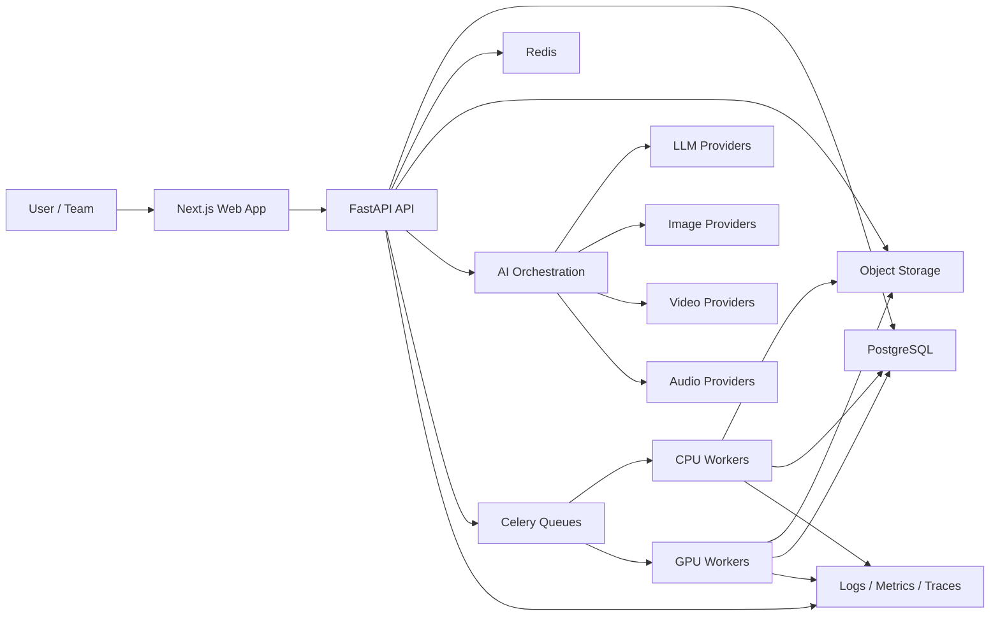
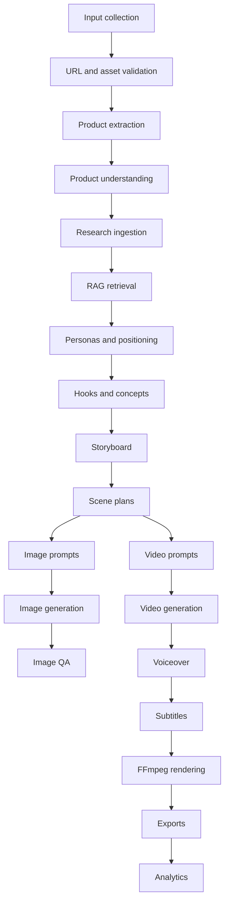

# AI Advertisement Generation Platform Blueprint

Status: Draft architecture blueprint  
Prepared for: Growkaro / AI Advertisement Generation Platform  
Date: 2026-08-06  
Repository inspected: `C:\Users\user\OneDrive\Desktop\25_WebAdOptimization_UpperConfidenceBound_ReinforcementLearning`

## Table of Contents

1. Executive Summary
2. Existing Project Audit
3. Product Vision
4. System Architecture
5. Database Design
6. API Design
7. AI Pipeline
8. Model Selection
9. Infrastructure
10. Security
11. DevOps
12. Deployment
13. Testing
14. Roadmap
15. Future Enhancements
16. Appendix

---

## 1. Executive Summary

Growkaro is currently a full-stack advertisement optimization prototype focused on UCB reinforcement learning, ad performance analysis, simple campaign guidance, and local-business-friendly reporting. The existing project is valuable and should not be discarded. It already contains a Next.js frontend, FastAPI backend, SQLAlchemy models, authentication routes, dataset upload, bandit algorithms, report export, Docker Compose, Kubernetes draft manifests, and CI.

The requested future product is much larger: a production-grade AI advertisement generation SaaS that accepts product URLs, product assets, campaign objectives, brand guidelines, and audience context, then generates product intelligence, marketing strategy, storyboards, prompts, images, videos, voiceovers, subtitles, exports, and analytics.

The safest product and engineering strategy is not to jump directly from the current UCB app to a giant media-generation platform. The correct path is staged:

1. Stabilize the current Growkaro foundation.
2. Move demo-only frontend state into backend-owned data.
3. Introduce workspaces, projects, campaigns, products, assets, and asynchronous jobs.
4. Build a text-first AI campaign intelligence MVP.
5. Add image generation behind job orchestration.
6. Add video, voiceover, subtitle, and rendering workflows.
7. Reuse the existing bandit optimization engine for campaign variation testing and analytics.

### Product Recommendation

Build the MVP as an "AI Campaign Studio" rather than a full video generation suite on day one.

MVP output should include:

- Product extraction from URL and manual inputs
- Product intelligence summary
- Persona generation
- Marketing hooks
- Campaign concepts
- Storyboard drafts
- Scene plans
- Image prompts
- Platform-specific ad copy
- Job history
- Usage records and credit tracking

Defer full video generation, voice cloning, music generation, GPU self-hosting, QLoRA fine-tuning, complex RAG, and automated competitor crawling until the core workflow is reliable.

### Architecture Recommendation

Use a modular monorepo:

- Frontend: Next.js, React, TypeScript, Tailwind CSS
- Backend API: FastAPI, Python, Pydantic, SQLAlchemy
- Database: PostgreSQL with Alembic migrations
- Queue: Redis plus Celery for MVP, with a possible later move to Temporal, Prefect, or cloud-native queues
- Storage: S3-compatible object storage
- AI orchestration: provider-adapter layer, model registry, prompt versioning, structured outputs, job state machine
- Retrieval: PostgreSQL plus pgvector first; Qdrant later if retrieval scale or filtering complexity requires it
- Media processing: FFmpeg workers
- Observability: structured logs, OpenTelemetry traces, metrics, job dashboards

### Top Critical Issues Found

| Issue | Impact | Priority |
|---|---|---|
| Live Vercel frontend calls `http://localhost:8000` for auth | Production login/upload cannot work for real users | Critical |
| Frontend stores users/history in localStorage fallback | Not a trustworthy SaaS data model | Critical |
| AI ad generation is not implemented | Product gap versus requested vision | Critical |
| Long-running work is synchronous or placeholder | AI/media jobs will timeout or fail unreliably | Critical |
| No migrations; tables are created with `Base.metadata.create_all()` | Unsafe production schema changes | High |
| Uploads are local filesystem only | Not viable for generated media, previews, CDN, or scaling | High |
| Default JWT secret fallback exists | Security risk if misconfigured | High |

---

## 2. Existing Project Audit

### 2.1 What Was Inspected

Local files inspected:

- `README.md`
- `docker-compose.yml`
- `.github/workflows/ci.yml`
- `backend/requirements.txt`
- `backend/Dockerfile`
- `backend/app/main.py`
- `backend/app/models/database.py`
- `backend/app/core/config.py`
- `backend/app/core/security.py`
- `backend/app/api/deps.py`
- `backend/app/api/routes/auth.py`
- `backend/app/api/routes/datasets.py`
- `backend/app/api/routes/experiments.py`
- `backend/app/api/routes/simulations.py`
- `backend/app/api/routes/admin.py`
- `backend/app/services/dataset_service.py`
- `backend/app/services/insight_service.py`
- `backend/app/workers/tasks.py`
- `backend/app/ml_models/*`
- `backend/tests/*`
- `frontend/package.json`
- `frontend/src/app/*`
- `frontend/src/lib/*`
- `frontend/src/components/*`
- `frontend/tailwind.config.js`
- `infra/k8s/optictr-ai.yaml`

Live demo inspected:

- `https://grow-karo-psi.vercel.app/`
- Desktop viewport: 1440 x 1000
- Mobile viewport: 390 x 844
- Login network behavior

Could not inspect:

- GitHub repository history, branches, issues, PRs, secrets, Vercel settings, or production backend deployment because the repository and deployment credentials were not provided.
- Real production database contents.
- Real user behavior, analytics, conversion rates, error logs, or monitoring dashboards.

### 2.2 Executive Assessment

Growkaro is a strong educational and hackathon-quality prototype with a coherent product narrative: help local businesses choose better ads using reinforcement learning analytics.

It is not yet a production AI advertisement generation platform. The existing system is best treated as a reusable foundation, not the final architecture. The UI/brand, bandit optimization engine, dataset flow, and reporting ideas should be preserved. The auth, persistence, async job model, storage, API versioning, and deployment posture need significant refactoring before media generation is added.

### 2.3 Strengths

| Area | Strength |
|---|---|
| Product | Clear Growkaro positioning for local businesses and simple ad recommendations |
| Frontend | Polished hero, branded visuals, responsive first screen, useful dashboard components |
| Backend | Clean FastAPI route separation and modular ML model structure |
| ML | UCB, Thompson Sampling, Epsilon Greedy, Softmax, and Random Baseline modules exist |
| Auth | Basic JWT signup/login and role concept already exist |
| Data | SQLAlchemy models for users, datasets, experiments, analytics, reports, simulations, and audit logs |
| Testing | Backend smoke test and UCB tests exist |
| Infra | Docker Compose, worker scaffold, Kubernetes draft, and GitHub Actions CI exist |

### 2.4 Weaknesses

| Area | Weakness | Priority |
|---|---|---|
| Production API wiring | Deployed frontend calls localhost backend | Critical |
| AI generation | No product extraction, prompt orchestration, image/video/audio generation, or RAG | Critical |
| Persistence | Browser localStorage is used for users/history fallback | Critical |
| Jobs | Celery task is a placeholder; training still runs synchronously | High |
| Schema | No Alembic migrations | High |
| Frontend type safety | JavaScript rather than TypeScript | Medium |
| API shape | No `/api/v1` versioning or idempotency | High |
| Uploads | Local filesystem storage only | High |
| Security | Default secrets and incomplete session lifecycle | High |
| Observability | No structured logging, tracing, metrics, queue dashboards, or cost tracking | High |

### 2.5 Critical Risks

1. Production users cannot authenticate if the deployed frontend keeps calling `http://localhost:8000`.
2. If localStorage history is treated as real data, admin views and user isolation will be unreliable.
3. Long AI/media generation calls will fail without asynchronous job orchestration.
4. Generated media costs can grow uncontrollably without usage records, quotas, and credit policies.
5. Product URL ingestion can introduce SSRF, malware, copyright, and scraping abuse risks.
6. Voice and video generation introduce deepfake, consent, licensing, and moderation risks.

### 2.6 Technical Debt

| Debt | Why It Matters | Recommendation |
|---|---|---|
| `Base.metadata.create_all()` | Cannot safely evolve production schema | Add Alembic before new tables |
| Local upload directory | Does not scale across containers or CDNs | Add object storage abstraction |
| Browser-owned users/history | Breaks SaaS data ownership | Move all persistence to backend |
| Unversioned endpoints | Hard to evolve clients safely | Add `/api/v1` |
| Placeholder Celery task | Creates false production confidence | Implement real job contracts |
| No refresh token persistence | Cannot revoke sessions or detect theft | Store hashed refresh tokens |
| No explicit rate limiter | API can be abused | Add Redis-backed rate limits |

### 2.7 UX Problems

| Problem | Impact | Priority |
|---|---|---|
| Mobile top navigation only shows login | Users cannot quickly discover protected areas on mobile | Medium |
| First mobile hero is very tall | Slow access to next section and product proof | Low |
| Ad creation page is rule-based but visually implies generation | User expectations may exceed actual functionality | High |
| Auth failures are generic | Hard for users to distinguish offline backend from bad credentials | Medium |
| Some protected flows redirect abruptly | Better loading and auth state handling needed | Medium |

### 2.8 Product Problems

| Problem | Impact | Priority |
|---|---|---|
| Current product optimizes existing ads, not generating new ads | Major mismatch with target vision | Critical |
| No workspace/project/campaign concepts | Cannot support agencies, teams, or multiple brands | Critical |
| No asset library | Cannot manage brand kits or generated media | Critical |
| No usage credits | Cannot monetize or control AI costs | High |
| No campaign review workflow | Generated assets need human approval | High |

### 2.9 Security Concerns

| Concern | Current State | Required State |
|---|---|---|
| JWT secret | Defaults to `change-this-secret-in-production` | Fail startup if production secret is missing |
| Token storage | JS-accessible localStorage/cookie | Prefer httpOnly secure cookies or hardened token strategy |
| Upload validation | Extension and size checks | MIME sniffing, malware scan, object storage, signed URLs |
| Authorization | Route-level owner checks | Workspace-level RBAC and row-level authorization rules |
| SSRF | Not applicable yet | Required before product URL ingestion |
| Rate limiting | Config value exists but not enforced | Redis-backed enforcement |
| Audit logs | Model exists | Actually write audit events |

### 2.10 Scalability Concerns

| Concern | Why It Matters |
|---|---|
| Synchronous training | Blocks API workers and does not generalize to AI/media workloads |
| Local files | Generated media must survive container restarts and be CDN-addressable |
| No job state machine | Users need retry, cancel, resume, and progress visibility |
| No provider abstraction | Model/vendor lock-in and migration pain |
| No cost records | Cannot price or throttle usage |

### 2.11 Recommended Improvements

| Recommendation | Priority | Affected Areas | Expected Impact |
|---|---|---|---|
| Fix production API base URL | Critical | Vercel env, frontend API config | Makes live app usable |
| Add Alembic migrations | High | Backend DB | Safe schema evolution |
| Add workspaces/projects/campaigns | Critical | Backend DB/API, frontend IA | SaaS-ready domain model |
| Move local history to backend | High | Frontend local-history, backend routes | Real persistence and admin accuracy |
| Implement job state machine | Critical | Backend jobs/workers/frontend status | Reliable AI/media workloads |
| Add object storage service | Critical | Uploads/assets/generated media | Durable scalable asset pipeline |
| Add provider adapters | High | AI orchestration | Replaceable model providers |
| Add usage and credit tracking | High | Billing/usage DB/API | Cost control and monetization |
| Convert frontend to TypeScript gradually | Medium | Frontend | Safer large-scale UI development |

### 2.12 What Should Be Preserved

- Growkaro brand and local-business language
- Owner-friendly reporting tone
- UCB/bandit optimization engine
- FastAPI backend foundation
- Next.js frontend foundation
- Dashboard and chart concepts
- Report export idea
- Docker Compose local stack concept
- CI split between backend and frontend

### 2.13 What Should Be Refactored

- Auth/session storage
- Local history/admin data
- API endpoint versioning
- Dataset and experiment schemas into a broader campaign domain
- Upload storage
- Synchronous training into jobs
- Frontend route structure around campaigns/projects

### 2.14 What Should Be Replaced

- Demo localStorage user fallback
- Placeholder Celery worker task
- Localhost-only production API assumption
- `create_all()` schema initialization in production
- Static admin monitoring values

### 2.15 Migration Strategy

1. Stabilize current app deployment and server-owned data.
2. Add migrations and baseline existing schema.
3. Add workspace/project/campaign tables while keeping datasets/experiments.
4. Introduce `generation_jobs` as the unified async abstraction.
5. Move ad creation page to a backend-powered campaign brief workflow.
6. Add text-only AI generation.
7. Add asset storage and image generation.
8. Add video/audio/rendering only after job orchestration is proven.
9. Keep UCB as the analytics and variation optimization engine.

### 2.16 Prioritized Action Plan

| Order | Action | Priority |
|---:|---|---|
| 1 | Fix deployed API URL and environment handling | Critical |
| 2 | Add Alembic and baseline migration | High |
| 3 | Replace localStorage history with backend history APIs | High |
| 4 | Add workspaces, projects, campaigns, products | Critical |
| 5 | Add asset upload and object storage abstraction | Critical |
| 6 | Implement async jobs with idempotency and progress | Critical |
| 7 | Build text-first AI campaign generation | Critical |
| 8 | Add image generation provider adapter | High |
| 9 | Add usage credits and quotas | High |
| 10 | Add observability and security hardening | High |

### 2.17 Questions Requiring Clarification

1. Should the future platform keep the Growkaro name?
2. Should the MVP include image generation, or stop at strategy/storyboards/prompts?
3. Which deployment provider should host FastAPI: Render, Fly.io, Railway, AWS, GCP, Azure, or Kubernetes?
4. Should authentication be custom JWT or managed auth such as Clerk, Auth0, or Supabase Auth?
5. What initial market should the product target: agencies, local businesses, ecommerce sellers, creators, or internal marketers?

---

## 3. Product Vision

### 3.1 Vision

Build a secure, cost-aware, production-grade AI advertisement generation platform that turns a product URL, brand assets, product images, and campaign goals into platform-ready ad concepts, storyboards, generated assets, and measurable campaign variations.

### 3.2 Target Users

| User | Need |
|---|---|
| Local business owner | Generate clear ads without hiring an agency |
| Ecommerce seller | Turn product pages and reviews into product ads |
| Performance marketer | Produce many ad variations and test winners |
| Agency creative team | Generate drafts faster while preserving brand control |
| Startup founder | Build launch campaigns from limited brand assets |
| Analyst | Compare creative performance and recommend budget allocation |

### 3.3 Personas

| Persona | Situation | Success Looks Like |
|---|---|---|
| Owner Anika | Runs a local food business | Gets 5 usable Instagram ad ideas in minutes |
| Marketer Jay | Manages paid social ads | Creates 20 hook variations and exports structured briefs |
| Agency Lead Meera | Handles many clients | Keeps brand kits, approvals, and exports organized |
| Ecommerce Seller Arjun | Sells online products | Converts product URL and reviews into short-video scripts |
| Analyst Riya | Reviews ad results | Uses UCB/bandit analytics to recommend winners |

### 3.4 Jobs To Be Done

- When I have a product URL, I want the platform to understand the product so that I do not manually write a brief.
- When I need ad ideas, I want multiple hooks and concepts so that I can choose the best creative direction.
- When I need short-form video, I want a storyboard and scene plan so that the generated video is coherent.
- When generation fails, I want retry and clear error information so that I do not lose work or credits unfairly.
- When I generate expensive media, I want previews before final-quality rendering so that I can control cost.

### 3.5 Pain Points

- Manual campaign research is slow.
- AI tools often produce generic claims.
- Product consistency across generated images is hard.
- Video generation is expensive and failure-prone.
- Teams need approval workflows.
- Non-technical users need simple explanations.
- AI costs need to be predictable.

### 3.6 Core Use Cases

1. Create a campaign from product URL.
2. Upload product images and brand kit.
3. Generate product intelligence.
4. Generate customer personas.
5. Generate hooks and ad concepts.
6. Generate storyboard and scene plan.
7. Generate image prompts and video prompts.
8. Generate image assets.
9. Generate video clips.
10. Generate voiceover, captions, and subtitles.
11. Render final ad variants.
12. Export platform-specific formats.
13. Track usage and campaign history.
14. Analyze campaign performance.

### 3.7 Feature Map

| Area | MVP | Version 1 | Future |
|---|---|---|---|
| Auth | Email/password or managed auth | Workspaces and RBAC | Enterprise SSO |
| Campaigns | Product URL/manual brief | Project folders and statuses | Client approval portals |
| Research | Product page extraction | Reviews, competitors, trends | Continuous monitors |
| AI text | Product intelligence, hooks, storyboard | Brand-aware prompt templates | Multi-agent research |
| Images | Prompt generation only or hosted API | Reference images and variants | Fine-tuned style models |
| Video | Storyboard and video prompts | Hosted image-to-video | Self-hosted GPU workflows |
| Audio | Script and captions | TTS voiceovers | Licensed voice cloning |
| Rendering | Export text/assets | FFmpeg render jobs | Dynamic templates |
| Billing | Usage records | Credit packs/subscriptions | Enterprise contracts |
| Analytics | History and usage | Campaign results | Bandit budget optimization |

### 3.8 MVP Scope

MVP should include:

- User accounts
- Workspaces
- Projects
- Campaigns
- Product URL and manual product input
- Product image upload
- Product extraction
- Structured product intelligence
- Personas
- Hooks
- Concepts
- Storyboards
- Scene plans
- Image and video prompt generation
- Job tracking
- Saved history
- Credit ledger
- Basic admin dashboard

MVP should not include:

- Self-hosted GPU inference
- Voice cloning
- Music generation
- Full automated competitor crawling at scale
- Automatic publishing to ad platforms
- Enterprise SSO
- Complex multi-agent workflow

### 3.9 Version 1 Scope

Version 1 should add:

- Brand kits
- Hosted image generation
- Hosted image-to-video generation
- Voiceover generation
- Subtitle generation
- FFmpeg rendering
- Exports for TikTok, Reels, YouTube Shorts, YouTube, Facebook, LinkedIn, display ads
- Moderation workflow
- Usage quotas and paid plans
- RAG over product pages, reviews, and research docs
- Campaign analytics import

### 3.10 Future Roadmap

Future platform capabilities:

- GPU worker pool
- Self-hosted Diffusers pipelines
- LoRA for brand/style consistency
- Advanced product preservation
- Competitor monitoring
- Trend monitoring
- Creative performance prediction
- Multi-armed bandit optimization for generated variants
- Ad platform integrations
- Collaboration and approvals
- Enterprise compliance controls

### 3.11 Explicitly Excluded For Now

- Fully autonomous ad publishing
- Scraping private or paywalled sources
- Scraping sites that disallow crawling
- Voice cloning without explicit consent
- Deepfake-like likeness generation
- Copyright-infringing music/image generation
- Unverified factual claims in ads
- Guaranteed product/character consistency claims

### 3.12 Monetization

Potential models:

- Free tier with limited text generations
- Monthly subscription with credits
- Pay-as-you-go credit packs
- Team plan with workspaces and approvals
- Agency plan with multiple brand kits
- Enterprise plan with SSO, audit logs, custom retention

### 3.13 Credit System

Use credits because AI costs vary by model and media type.

| Action | Credit Policy |
|---|---|
| Product extraction | Low cost |
| Hook/concept generation | Low cost |
| Storyboard generation | Medium cost |
| Image preview | Medium cost |
| Final image | Higher cost |
| Video preview | High cost |
| Final video render | Very high cost |
| Failed provider call | Do not charge unless useful output is delivered |
| User cancellation | Charge only completed stages |

### 3.14 Success Metrics

| Metric | Purpose |
|---|---|
| Time to first campaign brief | Onboarding speed |
| Concept acceptance rate | Creative quality |
| Regeneration rate | Quality and user control |
| Export completion rate | End-to-end product usefulness |
| Cost per completed ad | Unit economics |
| Job failure rate | Reliability |
| Credit conversion rate | Monetization |
| Weekly active campaign creators | Retention |

North-star metric: completed, exported ad variants per active workspace per week.

### 3.15 User Flows

#### Account Creation

1. User enters email/password or uses OAuth.
2. Backend creates user and default workspace.
3. User verifies email if required.
4. User lands in onboarding.

#### Onboarding

1. Ask business type, role, typical platform, language.
2. Offer sample campaign or new campaign.
3. Create first project.

#### Creating A Campaign

1. User selects project.
2. User enters product URL or manual product details.
3. User uploads product images and optional brand assets.
4. Backend creates campaign and product sources.
5. Product analysis job starts.

#### Product URL Flow

1. Validate URL scheme and hostname.
2. SSRF guard checks private IPs and blocked domains.
3. Fetch via controlled crawler.
4. Extract title, price, images, descriptions, claims.
5. Store raw source and cleaned document.
6. Run product extraction model with structured schema.

#### Image Upload Flow

1. Client requests signed upload URL.
2. Client uploads to object storage.
3. Backend records asset metadata.
4. Malware scan and MIME validation run.
5. Vision analysis creates asset descriptions.

#### Marketing Research Flow

1. Discover allowed product/review/competitor/trend sources.
2. Crawl within rate limits.
3. Extract and normalize content.
4. Chunk and embed.
5. Retrieve evidence for campaign generation.
6. Cite sources in generated insights.

#### Storyboard Flow

1. Generate concepts.
2. User selects concept.
3. Generate storyboard with scenes.
4. User edits scene copy, visual direction, CTA.
5. Save storyboard version.

#### Image Generation Flow

1. Generate image prompts per scene.
2. User approves prompt.
3. Create image generation job.
4. Provider returns images.
5. Store assets and metadata.
6. Run quality checks.
7. User accepts or regenerates.

#### Video Generation Flow

1. Select approved scene images or prompts.
2. Create video generation jobs per scene.
3. Track progress asynchronously.
4. Store clips.
5. Assemble render plan.

#### Voiceover, Music, Subtitles, Rendering

1. Generate voiceover script.
2. Generate or select licensed voice.
3. Generate subtitles from script or transcription.
4. Normalize audio.
5. Render with FFmpeg.
6. Export platform-specific assets.

#### Failure Handling

1. Job fails with typed error.
2. User sees clear cause and retry option.
3. Retry uses same idempotency key where appropriate.
4. Credits are charged only for completed useful output.

---

## 4. System Architecture

### 4.1 Architecture Principles

1. Use a modular monolith plus workers before microservices.
2. Treat AI and media generation as asynchronous jobs.
3. Make model providers replaceable.
4. Store durable state in PostgreSQL.
5. Store large files in object storage.
6. Keep Redis for queues, cache, locks, and rate limits.
7. Version prompts and schemas.
8. Use structured outputs and validation.
9. Track cost, latency, and quality per model execution.
10. Make every expensive operation idempotent.

### 4.2 System Context



### 4.3 Container-Level Architecture

| Service | Responsibility | MVP Required |
|---|---|---|
| Frontend | Campaign UI, asset library, job progress, exports | Yes |
| API | Auth, domain APIs, job creation, provider orchestration | Yes |
| PostgreSQL | Relational business data, job state, usage records | Yes |
| Redis | Celery broker, cache, locks, rate limits | Yes |
| Celery CPU workers | Crawling, extraction, LLM calls, embeddings, FFmpeg light jobs | Yes |
| GPU workers | Self-hosted image/video inference | Deferred |
| Object storage | Uploaded and generated assets | Yes |
| Vector index | Retrieval over product/research docs | MVP can use pgvector |
| Observability stack | Logs, traces, metrics, alerts | Yes |
| Billing service | Credits, subscriptions, webhooks | V1 |

### 4.4 Component-Level Backend Architecture

```text
backend/app/
  api/
    routes/
      v1/
        auth.py
        workspaces.py
        projects.py
        campaigns.py
        products.py
        assets.py
        research.py
        storyboards.py
        generations.py
        jobs.py
        usage.py
        exports.py
  core/
    config.py
    security.py
    logging.py
    rate_limits.py
  db/
    session.py
    migrations/
  models/
    user.py
    workspace.py
    campaign.py
    product.py
    asset.py
    generation.py
    usage.py
  schemas/
    requests.py
    responses.py
    ai_outputs.py
  services/
    auth_service.py
    asset_service.py
    campaign_service.py
    job_service.py
    usage_service.py
  ai/
    registry.py
    providers/
    prompts/
    evaluators/
    guardrails/
  ingestion/
    crawler.py
    extractors.py
    normalizers.py
  retrieval/
    embeddings.py
    vector_store.py
    rerankers.py
  media/
    ffmpeg.py
    subtitles.py
    audio.py
  workers/
    celery_app.py
    tasks/
```

### 4.5 Recommended Monorepo Structure

```text
.
  README.md
  docker-compose.yml
  .env.example
  docs/
    architecture/
    adr/
    api/
    security/
  frontend/
    src/
      app/
      components/
      features/
      lib/
      types/
  backend/
    app/
    alembic/
    tests/
  shared/
    schemas/
    openapi/
  infra/
    docker/
    k8s/
    terraform/
    monitoring/
  scripts/
```

Recommendation: use a monorepo for MVP and V1. It keeps API schemas, frontend types, workers, and infrastructure coordinated. Move to polyrepo only if teams, deployment cadence, or access boundaries require it.

### 4.6 Alternative Polyrepo Structure

```text
growkaro-web/
growkaro-api/
growkaro-workers/
growkaro-infra/
growkaro-shared-schemas/
```

Polyrepo is better only when separate teams need independent release cycles.

### 4.7 Dependency Boundaries

- Frontend may import shared generated API types, not backend internals.
- Backend routes depend on services, not directly on provider SDKs.
- Provider adapters depend on external SDKs.
- Jobs call services and adapters through stable interfaces.
- Database models should not call provider APIs.
- Prompt templates should be versioned and tested.

### 4.8 Technology Evaluation

| Technology | Required | Problem Solved | Alternatives | Cost/Complexity | Recommendation |
|---|---|---|---|---|---|
| Next.js | Yes | Full-stack React UI, routing, SSR where useful | Vite, Remix | Medium | Keep and move to TypeScript |
| TypeScript | Yes | Safer UI contracts | JavaScript | Low/Medium | Adopt gradually |
| Tailwind CSS | Yes | Fast consistent UI styling | CSS Modules, MUI | Low | Keep |
| FastAPI | Yes | Typed Python API, OpenAPI | Django, Flask, NestJS | Medium | Keep |
| PostgreSQL | Yes | Durable relational data | MySQL, MongoDB | Medium | Use managed Postgres |
| Redis | Yes | Queue broker, cache, rate limits | RabbitMQ, SQS | Medium | Keep for MVP |
| Celery | Yes for MVP | Async background jobs | RQ, Dramatiq, Temporal | Medium | Keep initially |
| Object storage | Yes | Durable media storage | Local disk, database blobs | Low/Medium | Use S3-compatible storage |
| Docker | Yes | Local parity and deployment packaging | Nix, bare VM | Medium | Keep |
| Kubernetes | Deferred | Advanced orchestration | Fly/Render/Railway/ECS | High | Defer until needed |
| FFmpeg | Yes for rendering | Video/audio composition | Remotion, MoviePy | Medium | Use worker abstraction |
| Playwright | Yes | Browser extraction and E2E tests | Selenium | Medium | Use selectively |
| BeautifulSoup | Optional | Simple HTML parsing | lxml, selectolax | Low | Use for simple extraction |
| Trafilatura | Optional | Main-text extraction | readability-lxml | Low | Use for article/product content |
| pgvector | Yes for MVP RAG | Embeddings in Postgres | Qdrant, Weaviate | Low/Medium | Start here |
| Qdrant | Deferred | Scalable vector search/filtering | pgvector, Weaviate | Medium | Add when needed |
| LangChain | Optional | Common orchestration abstractions | Custom layer, LlamaIndex | Medium | Avoid until clear benefit |
| LlamaIndex | Optional | Document ingestion/retrieval workflows | Custom layer | Medium | Consider for RAG-heavy V1 |
| Diffusers | Deferred | Self-hosted image models | Hosted APIs | High | Use later |
| LoRA | Deferred | Style/product consistency adaptation | Prompting, reference images | High | Use after dataset exists |
| QLoRA/PEFT | Deferred | Efficient fine-tuning | Prompting, RAG | High | Not MVP |
| Whisper/local ASR | Optional | Transcription/subtitles | Hosted ASR | Medium | Use hosted first |
| XTTS | Deferred | Local TTS/voice cloning | Hosted TTS | High risk | Defer; consent required |

### 4.9 Architecture Decision Records

#### ADR-001: Modular Monolith First

- Decision: Use one FastAPI backend with modules and workers.
- Context: Small team, broad domain, fast iteration.
- Options: Modular monolith, microservices, serverless-only.
- Selected: Modular monolith plus Celery workers.
- Rationale: Lower operational overhead and easier transactions.
- Tradeoff: Requires discipline around module boundaries.
- Reversal: Split workers/providers into services when load requires.

#### ADR-002: Async Jobs For AI/Media

- Decision: Every expensive generation runs as a job.
- Context: AI media calls are slow, costly, and failure-prone.
- Options: Synchronous API, background tasks, Celery, Temporal.
- Selected: Celery for MVP with durable job rows.
- Rationale: Existing scaffold, Python ecosystem, Redis already planned.
- Tradeoff: Complex retries/cancellation need careful implementation.
- Reversal: Move to Temporal if workflows become highly stateful.

#### ADR-003: pgvector Before Qdrant

- Decision: Start with pgvector inside PostgreSQL.
- Context: Early retrieval scale is moderate.
- Options: pgvector, Qdrant, Weaviate, Pinecone.
- Selected: pgvector for MVP.
- Rationale: Fewer services and simpler backup/access control.
- Tradeoff: Less specialized vector search functionality.
- Reversal: Add Qdrant when retrieval scale or filtering requires it.

#### ADR-004: Hosted AI Providers Before Self-Hosted GPU

- Decision: Start with hosted model providers.
- Context: GPU operations are expensive and complex.
- Options: Hosted APIs, self-hosted Diffusers, hybrid.
- Selected: Hosted first, hybrid later.
- Rationale: Faster MVP and less operational risk.
- Tradeoff: Provider costs and availability constraints.
- Reversal: Add GPU workers for predictable high-volume workloads.

---

## 5. Database Design

### 5.1 Storage Rules

Use PostgreSQL for:

- Users, organizations, permissions
- Projects, campaigns, products
- Job state
- Generation metadata
- Usage, billing, audit logs
- Structured outputs and version metadata

Use JSONB for:

- Provider-specific metadata
- Flexible AI output payloads after schema validation
- Platform export settings
- Non-query-heavy structured details

Avoid JSONB for:

- Frequently filtered core fields
- Ownership and authorization fields
- Large raw documents
- Large model responses that should live in object storage

Use Redis for:

- Celery broker/result state
- Short-lived locks
- Rate limits
- Cache entries
- Live job progress fanout

Use object storage for:

- Uploaded product images
- Brand assets
- Generated images
- Video clips
- Audio files
- Rendered exports
- Raw crawl snapshots when large

Use pgvector for:

- MVP embeddings tied to research documents and product context

Use Qdrant for:

- Later high-scale vector search with advanced filtering, multitenancy, or hybrid retrieval needs

### 5.2 Core Tables

| Table | Purpose | Key Columns | Constraints / Indexes | Retention / Privacy |
|---|---|---|---|---|
| users | User accounts | id, email, name, password_hash, status, created_at | unique email | Delete/anonymize on account deletion |
| organizations | Workspaces/companies | id, name, slug, owner_id, plan | unique slug | Retain while active |
| memberships | User roles in orgs | id, org_id, user_id, role | unique org_id/user_id | Delete on removal |
| projects | Campaign folders | id, org_id, name, status | index org_id | Retain until deleted |
| campaigns | Main ad-generation unit | id, project_id, objective, platform, language, status | index project_id/status | Retain per plan |
| products | Product intelligence target | id, campaign_id, name, description, url, category | index campaign_id | User data |
| product_sources | URLs/manual sources | id, product_id, source_type, url, extracted_text_ref | index product_id | Respect deletion |
| product_assets | Product images/files | id, product_id, asset_id, role | index product_id | Delete object on request |
| brand_kits | Brand identity | id, org_id, name, colors, fonts, voice | index org_id | Sensitive brand data |
| personas | Generated target personas | id, campaign_id, schema_version, payload | index campaign_id | Regenerate/version |
| competitors | Competitor records | id, campaign_id, name, url, notes | index campaign_id | Delete with campaign |
| market_insights | Research insights | id, campaign_id, insight_type, claim, citations | index campaign_id/type | Source-sensitive |
| trends | Trend observations | id, campaign_id, keyword, source, score | index keyword/source | Refresh/expire |
| reviews | Product review snippets | id, product_id, source, rating, text_ref | index product_id/source | Respect source policy |
| research_documents | Cleaned research docs | id, org_id, campaign_id, source_url, content_ref, hash | hash unique per org | Delete on request |
| embeddings_metadata | Vector metadata | id, document_id, chunk_index, vector_id, model | index document_id | Delete with document |
| campaign_strategies | Strategy output | id, campaign_id, version, payload | unique campaign/version | Keep versions |
| hooks | Marketing hooks | id, campaign_id, text, angle, score | index campaign_id | Keep accepted/rejected |
| storyboards | Storyboard versions | id, campaign_id, title, version, status | unique campaign/version | Keep versions |
| scenes | Storyboard scenes | id, storyboard_id, position, duration, payload | unique storyboard/position | Keep versions |
| prompts | Prompt records | id, campaign_id, scene_id, kind, prompt_text, version | index campaign/kind | Keep for reproducibility |
| generation_jobs | Async job state | id, org_id, campaign_id, kind, status, idempotency_key | unique org/idempotency_key | Retain job history |
| model_executions | Provider call records | id, job_id, provider, model, latency_ms, cost_units, status | index job/provider/model | Cost/audit record |
| generated_assets | AI outputs | id, campaign_id, job_id, asset_id, kind, status | index campaign/kind | Delete object on request |
| voiceovers | Voiceover metadata | id, campaign_id, script, voice_id, asset_id | index campaign | Consent/licensing |
| music | Music metadata | id, campaign_id, source, license, asset_id | index campaign | License-sensitive |
| subtitles | Subtitle metadata | id, campaign_id, format, language, asset_id | index campaign | Delete with campaign |
| render_jobs | FFmpeg render jobs | id, campaign_id, status, render_plan, output_asset_id | index campaign/status | Keep logs |
| exports | Platform exports | id, campaign_id, platform, asset_id, settings | index campaign/platform | Retain per plan |
| usage_records | Usage ledger | id, org_id, user_id, job_id, credits_delta, reason | index org/created_at | Billing record |
| credit_balances | Current balances | org_id, balance, updated_at | pk org_id | Billing record |
| billing_events | Provider/billing events | id, org_id, provider, event_type, payload | unique provider_event_id | Compliance retention |
| audit_logs | Security/admin events | id, org_id, actor_id, action, target_type, target_id | index org/action/date | Long retention |
| notifications | User notifications | id, user_id, type, payload, read_at | index user/read | Short retention |
| analytics_events | Product analytics | id, org_id, user_id, event_name, payload | index org/event/date | Aggregate/anonymize |

### 5.3 Example Records

```json
{
  "users": {
    "id": "usr_123",
    "email": "owner@example.com",
    "name": "Anika",
    "status": "active"
  },
  "organizations": {
    "id": "org_123",
    "name": "Anika Foods",
    "plan": "starter"
  },
  "campaigns": {
    "id": "cmp_123",
    "project_id": "prj_123",
    "objective": "sales",
    "platform": "instagram_reels",
    "language": "en-IN",
    "status": "draft"
  },
  "products": {
    "id": "prd_123",
    "campaign_id": "cmp_123",
    "name": "Spicy Millet Chips",
    "url": "https://example.com/products/millet-chips"
  },
  "generation_jobs": {
    "id": "job_123",
    "kind": "storyboard_generation",
    "status": "running",
    "progress": 45,
    "idempotency_key": "cmp_123:storyboard:v1"
  },
  "model_executions": {
    "id": "mex_123",
    "job_id": "job_123",
    "provider": "openai",
    "model": "gpt-5.6-terra",
    "latency_ms": 4200,
    "status": "succeeded"
  },
  "generated_assets": {
    "id": "gen_123",
    "campaign_id": "cmp_123",
    "kind": "image",
    "asset_id": "ast_123",
    "status": "ready"
  }
}
```

### 5.4 Migration Example

```python
# backend/alembic/versions/0002_add_campaigns.py
from alembic import op
import sqlalchemy as sa


revision = "0002_add_campaigns"
down_revision = "0001_baseline"


def upgrade() -> None:
    op.create_table(
        "campaigns",
        sa.Column("id", sa.String(36), primary_key=True),
        sa.Column("project_id", sa.String(36), sa.ForeignKey("projects.id"), nullable=False),
        sa.Column("objective", sa.String(80), nullable=False),
        sa.Column("platform", sa.String(80), nullable=True),
        sa.Column("language", sa.String(20), nullable=False, server_default="en"),
        sa.Column("status", sa.String(40), nullable=False, server_default="draft"),
        sa.Column("created_at", sa.DateTime(timezone=True), nullable=False),
    )
    op.create_index("ix_campaigns_project_status", "campaigns", ["project_id", "status"])


def downgrade() -> None:
    op.drop_index("ix_campaigns_project_status", table_name="campaigns")
    op.drop_table("campaigns")
```

### 5.5 Transaction Boundaries

- Create campaign, product, and initial job in one transaction.
- Do not hold DB transactions while calling external AI providers.
- Workers should claim a job, commit status `running`, execute provider call, then commit output metadata.
- Object storage upload should happen before DB asset finalization, or use a pending asset state.
- Usage records must be written atomically with job completion when credits are charged.

---

## 6. API Design

### 6.1 API Conventions

- Prefix all new APIs with `/api/v1`.
- Use JSON request and response bodies.
- Use Pydantic schemas.
- Use cursor pagination for lists.
- Use idempotency keys for expensive creates.
- Use typed error responses.
- Use `202 Accepted` for async job creation.
- Use signed URLs for direct asset upload/download.

### 6.2 Standard Error Shape

```json
{
  "error": {
    "code": "quota_exceeded",
    "message": "This workspace does not have enough credits.",
    "request_id": "req_123",
    "details": {
      "required_credits": 50,
      "available_credits": 12
    }
  }
}
```

### 6.3 Endpoint Map

| Method | URL | Purpose | Auth | Idempotency | Job Behavior |
|---|---|---|---|---|---|
| POST | `/api/v1/auth/signup` | Create user | Public | No | Sync |
| POST | `/api/v1/auth/login` | Login | Public | No | Sync |
| POST | `/api/v1/auth/refresh` | Refresh token | Refresh token | No | Sync |
| POST | `/api/v1/auth/logout` | Revoke session | User | No | Sync |
| GET | `/api/v1/users/me` | Current user | User | No | Sync |
| GET | `/api/v1/workspaces` | List workspaces | User | No | Sync |
| POST | `/api/v1/workspaces` | Create workspace | User | Optional | Sync |
| GET | `/api/v1/projects` | List projects | Member | No | Sync |
| POST | `/api/v1/projects` | Create project | Member | Optional | Sync |
| GET | `/api/v1/campaigns` | List campaigns | Member | No | Sync |
| POST | `/api/v1/campaigns` | Create campaign | Member | Yes | Sync plus optional job |
| GET | `/api/v1/campaigns/{id}` | Campaign detail | Member | No | Sync |
| PATCH | `/api/v1/campaigns/{id}` | Update campaign | Editor | No | Sync |
| POST | `/api/v1/products` | Add product | Editor | Yes | Sync |
| POST | `/api/v1/products/{id}/ingest-url` | Ingest product URL | Editor | Yes | Returns job |
| POST | `/api/v1/assets/upload-url` | Create signed upload URL | Editor | Yes | Sync |
| POST | `/api/v1/assets/{id}/complete` | Finalize upload | Editor | Yes | May scan async |
| POST | `/api/v1/research/jobs` | Start research job | Editor | Yes | Returns job |
| GET | `/api/v1/competitors` | List competitors | Member | No | Sync |
| POST | `/api/v1/personas/generate` | Generate personas | Editor | Yes | Returns job |
| POST | `/api/v1/strategies/generate` | Generate strategy | Editor | Yes | Returns job |
| POST | `/api/v1/hooks/generate` | Generate hooks | Editor | Yes | Returns job |
| POST | `/api/v1/storyboards/generate` | Generate storyboard | Editor | Yes | Returns job |
| PATCH | `/api/v1/scenes/{id}` | Edit scene | Editor | No | Sync |
| POST | `/api/v1/prompts/generate` | Generate prompts | Editor | Yes | Returns job |
| POST | `/api/v1/images/generate` | Generate images | Editor | Yes | Returns job |
| POST | `/api/v1/videos/generate` | Generate video | Editor | Yes | Returns job |
| POST | `/api/v1/voiceovers/generate` | Generate voiceover | Editor | Yes | Returns job |
| POST | `/api/v1/music/select` | Select licensed music | Editor | Yes | Returns job or sync |
| POST | `/api/v1/subtitles/generate` | Generate subtitles | Editor | Yes | Returns job |
| POST | `/api/v1/renders` | Render final asset | Editor | Yes | Returns job |
| POST | `/api/v1/exports` | Create platform export | Editor | Yes | Returns job |
| GET | `/api/v1/jobs/{id}` | Job status | Member | No | Sync |
| POST | `/api/v1/jobs/{id}/cancel` | Cancel job | Editor | No | Async cancellation |
| POST | `/api/v1/jobs/{id}/retry` | Retry failed job | Editor | Yes | Returns job |
| GET | `/api/v1/jobs/{id}/events` | SSE job updates | Member | No | Stream |
| GET | `/api/v1/usage` | Usage records | Admin/member | No | Sync |
| GET | `/api/v1/analytics/events` | Analytics query | Admin | No | Sync |
| GET | `/api/v1/notifications` | Notifications | User | No | Sync |

### 6.4 Example Campaign Create Request

```json
{
  "project_id": "prj_123",
  "name": "Millet Chips Reels Campaign",
  "objective": "sales",
  "platform": "instagram_reels",
  "language": "en-IN",
  "target_audience": "Urban health-conscious snack buyers",
  "idempotency_key": "client-generated-uuid"
}
```

### 6.5 Example Async Response

```json
{
  "job": {
    "id": "job_123",
    "kind": "storyboard_generation",
    "status": "queued",
    "progress": 0,
    "campaign_id": "cmp_123"
  }
}
```

### 6.6 REST vs SSE vs WebSockets vs Webhooks vs Polling

| Pattern | Use When | Recommendation |
|---|---|---|
| REST | CRUD, job creation, final state reads | Default |
| Polling | Simple clients and low-frequency updates | Acceptable fallback |
| SSE | One-way job progress updates | Use for generation status |
| WebSockets | Collaborative editing or bidirectional live UX | Defer unless needed |
| Webhooks | External provider callbacks and billing events | Use for provider/billing integration |

---

## 7. AI Pipeline

### 7.1 Pipeline Overview



### 7.2 Stage Contracts

| Stage | Inputs | Outputs | Service/Model | Failure Modes | Retry / Observability |
|---|---|---|---|---|---|
| Input collection | URL, images, product fields | Campaign/product records | API | Invalid/missing fields | Validation errors |
| URL validation | URL | Safe fetch request | Crawler guard | SSRF, robots, timeout | No unsafe retries |
| Product extraction | HTML/text/images | Structured product JSON | Vision/LLM | Bad extraction | Retry with cleaned content |
| Image ingestion | Uploaded files | Asset metadata | Asset service | Malware/MIME fail | No retry without new file |
| Product understanding | Product JSON | Positioning facts | LLM structured output | Unsupported claims | Schema validation |
| Brand understanding | Brand kit/assets | Brand style guide | Vision/LLM | Ambiguous brand | Human review |
| Market research | Query/source list | Research docs | Crawler | Rate limits, blocked pages | Backoff and source skip |
| Competitor research | Competitor URLs | Competitor summaries | Crawler/LLM | Bad source, stale content | Citation tracking |
| Persona generation | Product/research | Personas | LLM | Generic personas | Eval rubric |
| Positioning | Product/personas | Value proposition | LLM | Weak differentiation | Human edit |
| Hook generation | Positioning/platform | Hooks | LLM | Repetitive hooks | Diversity scoring |
| Concept selection | Hooks/objective | Concepts | LLM/user | Poor fit | User approval |
| Storyboard | Concept | Scenes | LLM structured | Incoherent flow | Schema and review |
| Scene planning | Storyboard | Scene details | LLM | Timing mismatch | Validate duration |
| Camera planning | Scene | Camera directions | LLM | Unrealistic shots | Prompt QA |
| Image prompts | Scene/assets | Prompt records | LLM | Policy or quality issues | Prompt review |
| Video prompts | Scene/assets | Motion prompts | LLM | Inconsistent motion | Prompt review |
| Image generation | Prompt/ref images | Generated images | Hosted image or Diffusers | Provider fail, artifacts | Retry with same seed/version |
| Image consistency QA | Images/reference | Scores/findings | Vision model/rules | False positives | Human override |
| Scene regeneration | Feedback | New prompts/assets | LLM/provider | Repeated failure | Limit attempts |
| Image-to-video | Image/prompt | Clip assets | Hosted video/self-hosted | Long runtime, artifacts | Async retry |
| Voiceover | Script/voice | Audio asset | TTS | Bad pronunciation | Regenerate line |
| Music | Mood/license | Music asset | Licensed library/provider | License missing | Block export |
| Subtitles | Script/audio | SRT/VTT/ASS | ASR/alignment | Timestamp drift | Align and QA |
| Audio sync | Audio/video | Render plan | Media service | Drift/clipping | FFmpeg validation |
| Rendering | Clips/audio/subtitles | Final video | FFmpeg | Codec/filter fail | Retry deterministic |
| Quality validation | Output asset | QA report | Rules/vision/audio | Bad format/loudness | Block export |
| Platform adaptation | Final ad | Resized variants | FFmpeg | Crop/text overlap | Visual QA |
| Export | Variants | Download/share links | Export service | Storage/CDN fail | Retry |
| Analytics | Events/results | Reports | Analytics service | Missing events | Backfill |

### 7.3 AI Orchestration Layer

The orchestration layer should include:

- Model registry
- Provider adapters
- Prompt registry
- Prompt versions
- Output JSON schemas
- Retry policies
- Fallback models
- Token and cost budgets
- Context assembly
- Retrieval and citations
- Moderation
- Prompt injection defense
- Quality evaluation
- Human review gates

### 7.4 Model Registry Example

```json
{
  "product_extraction": {
    "primary": "openai:gpt-5.6-terra",
    "fallback": "openai:gpt-5.6-luna",
    "output_schema": "ProductExtractionV1",
    "max_retries": 2
  },
  "storyboard_generation": {
    "primary": "openai:gpt-5.6-terra",
    "quality_mode": "openai:gpt-5.6-sol",
    "output_schema": "StoryboardV1",
    "requires_citations": true
  },
  "image_generation": {
    "primary": "openai:gpt-image-2",
    "fallback": "hosted-image-provider",
    "output_schema": "GeneratedImageSetV1"
  }
}
```

### 7.5 Structured Output Schemas

#### Product Extraction

```json
{
  "type": "object",
  "additionalProperties": false,
  "required": ["name", "description", "features", "benefits", "claims", "audience"],
  "properties": {
    "name": {"type": "string"},
    "description": {"type": "string"},
    "features": {"type": "array", "items": {"type": "string"}},
    "benefits": {"type": "array", "items": {"type": "string"}},
    "claims": {
      "type": "array",
      "items": {
        "type": "object",
        "additionalProperties": false,
        "required": ["text", "evidence_url", "confidence"],
        "properties": {
          "text": {"type": "string"},
          "evidence_url": {"type": ["string", "null"]},
          "confidence": {"type": "number"}
        }
      }
    },
    "audience": {"type": "string"}
  }
}
```

#### Storyboard

```json
{
  "type": "object",
  "additionalProperties": false,
  "required": ["title", "concept", "platform", "duration_seconds", "scenes"],
  "properties": {
    "title": {"type": "string"},
    "concept": {"type": "string"},
    "platform": {"type": "string"},
    "duration_seconds": {"type": "integer"},
    "scenes": {
      "type": "array",
      "items": {
        "type": "object",
        "additionalProperties": false,
        "required": ["position", "duration_seconds", "visual", "voiceover", "on_screen_text", "cta"],
        "properties": {
          "position": {"type": "integer"},
          "duration_seconds": {"type": "integer"},
          "visual": {"type": "string"},
          "voiceover": {"type": "string"},
          "on_screen_text": {"type": "string"},
          "cta": {"type": "string"}
        }
      }
    }
  }
}
```

### 7.6 RAG And Research Intelligence

#### Source Discovery

Use sources only when legally and technically appropriate:

- Product page
- User-uploaded docs
- Public competitor pages
- Public reviews where terms allow
- News sources with permitted usage
- Google Trends official API only if approved access is available
- Reddit or social sources only with API/terms compliance

#### Crawling Rules

- Validate URL and prevent SSRF.
- Respect robots and terms.
- Rate-limit by domain.
- Store raw metadata and extraction timestamp.
- Hash content for deduplication.
- Keep source citations.
- Expire stale research.

#### Chunking And Metadata

Each chunk should include:

- Document ID
- Source URL
- Crawl time
- Language
- Content hash
- Product/campaign ID
- Source type
- Chunk index
- Text span reference

#### Retrieval Workflow

1. Build query from campaign objective and generation task.
2. Retrieve by embedding similarity.
3. Filter by campaign/product/source type/freshness.
4. Rerank if needed.
5. Pass only relevant evidence to LLM.
6. Require citations for factual claims.
7. Reject unsupported claims.

#### pgvector vs Qdrant

| Option | Best For | Tradeoff |
|---|---|---|
| pgvector | MVP, simple retrieval, fewer services | Less specialized at large scale |
| Qdrant | Advanced filtering, dedicated vector search, larger retrieval workloads | More infrastructure |

#### LangChain vs LlamaIndex vs Custom

| Option | Use When | Recommendation |
|---|---|---|
| Custom | You need clear control and small scope | Start here |
| LangChain | Many integrations/tools are needed | Use selectively |
| LlamaIndex | Document-heavy ingestion and retrieval dominate | Consider in V1 |

### 7.7 Prompt Injection Defense

- Treat web content as untrusted data.
- Separate system instructions from retrieved content.
- Wrap retrieved text as evidence, not instructions.
- Strip or flag hidden prompt-like text.
- Require citations for factual claims.
- Do not allow source content to choose tools, models, prices, or policies.

---

## 8. Model Selection

### 8.1 Model Categories

| Category | Use |
|---|---|
| General LLM | Product extraction, strategy, hooks, storyboards |
| Vision-language model | Product image understanding and QA |
| Embedding model | Retrieval over product/research documents |
| Reranker | Better evidence selection |
| Image generation model | Product/scene images |
| Image-to-video model | Animated scenes and clips |
| TTS model | Voiceovers |
| ASR model | Transcription and subtitle timing |
| Moderation model | Safety checks |
| Local/open model | Cost-sensitive or private workloads |

### 8.2 Recommended Provider Strategy

Use an adapter pattern:

```text
AI task -> Model registry -> Provider adapter -> External API or local worker
```

Do not put provider SDK calls directly inside route handlers.

### 8.3 Current Hosted Model Recommendation

As of the official documentation checked for this blueprint, OpenAI's model guidance describes GPT-5.6 family options for text/reasoning workflows, GPT Image models for image generation, and dedicated audio/transcription guides. Verify model availability and deprecations immediately before implementation.

| Workload | Recommended Starting Point | Why |
|---|---|---|
| Product extraction | Balanced reasoning/text model | Needs structured accuracy and citations |
| Campaign strategy | Higher-quality reasoning model when quality matters | Strategic quality affects final output |
| Hook generation | Lower-cost high-volume model | Many variants needed |
| Storyboard generation | Balanced or quality model | Coherence matters |
| Image prompt generation | Balanced text model | Needs visual precision |
| Image generation | Hosted image generation API first | Avoid GPU complexity |
| Video generation | Hosted video provider first | Expensive and operationally complex |
| Voiceover | Hosted TTS first | Consent/licensing easier |
| Subtitles | Hosted ASR or script alignment | Accuracy and timestamps matter |

### 8.4 Hosted APIs vs Self-Hosted Models

| Dimension | Hosted APIs | Self-Hosted |
|---|---|---|
| Startup speed | Fast | Slow |
| Operational complexity | Low | High |
| Unit cost at low volume | Usually acceptable | Often high |
| Customization | Limited | High |
| Data control | Provider-dependent | Better control |
| Reliability | Provider SLA dependent | Your responsibility |
| Best phase | MVP/V1 | Scale/future |

### 8.5 Diffusers, Hugging Face, LoRA, PEFT, QLoRA

| Technology | Role In This Project | Timing |
|---|---|---|
| Diffusers | Run image models locally and compose pipelines | Future |
| Hugging Face | Model hosting/discovery and open model ecosystem | V1/Future |
| LoRA | Style or brand adaptation with fewer parameters | Future |
| PEFT | Efficient fine-tuning methods | Future |
| QLoRA | Memory-efficient fine-tuning | Future, not MVP |

### 8.6 Practical Limitations

No model guarantees perfect:

- Product logo preservation
- Character consistency
- Brand consistency
- Scene continuity
- Legally safe claims
- Platform policy compliance

Mitigations:

- Reference images
- Prompt constraints
- Seed/version tracking
- QA scoring
- Human review
- Regeneration controls
- Policy checks
- Asset versioning

---

## 9. Infrastructure

### 9.1 Local Development

Use Docker Compose for:

- PostgreSQL
- Redis
- FastAPI
- Celery worker
- Frontend
- Optional local object storage such as MinIO

### 9.2 Production MVP

Recommended practical setup:

| Component | Starting Option |
|---|---|
| Frontend | Vercel |
| API | Render/Fly.io/Railway/AWS ECS |
| PostgreSQL | Managed Postgres |
| Redis | Managed Redis |
| Object storage | S3/R2/GCS/Azure Blob |
| Workers | Same host platform or ECS/Fly machines |
| Monitoring | Sentry plus OpenTelemetry-compatible backend |
| CDN | Object storage CDN or Cloudflare |

### 9.3 Scale-Out Deployment

Move to Kubernetes or ECS when:

- Worker concurrency grows
- GPU scheduling is needed
- Multiple services need autoscaling
- Traffic requires advanced rollout controls

### 9.4 Queue Topology

| Queue | Workload |
|---|---|
| `default` | Small backend jobs |
| `ingestion` | Crawling and extraction |
| `llm` | Text/structured generation |
| `embedding` | Embedding and indexing |
| `image` | Image generation |
| `video` | Video generation |
| `audio` | Voiceover/transcription |
| `render` | FFmpeg rendering |
| `maintenance` | Cleanup/backfills |

### 9.5 Job States

```text
queued -> running -> succeeded
queued -> running -> failed -> retrying -> running
queued -> cancelled
running -> cancelling -> cancelled
running -> timed_out
```

### 9.6 Worker Requirements

- Idempotent task contracts
- Provider timeouts
- Exponential backoff
- Dead-letter handling
- Heartbeats
- Progress updates
- Cancellation checks
- Cost recording
- Structured logs
- Correlation IDs

### 9.7 GPU Worker Architecture

GPU workers are deferred, but the future design should include:

- Resource-aware queues
- One model family per worker pool where possible
- Warm model loading
- VRAM-aware concurrency
- Autoscaling with queue depth
- Spot/preemptible instance support for non-urgent jobs
- Checkpointing for long video jobs
- Separate CPU render workers

---

## 10. Security

### 10.1 Threat Model

| Threat | Example | Priority | Mitigation |
|---|---|---|---|
| Broken object authorization | User accesses another campaign by ID | Critical | Workspace RBAC on every query |
| Broken auth | Stolen refresh token | Critical | Hashed refresh tokens, rotation, revocation |
| SSRF | Product URL hits internal metadata service | Critical | URL/IP allow/deny checks |
| Upload abuse | Malware or huge file upload | High | MIME sniff, malware scan, size limits |
| Prompt injection | Product page tells model to ignore policies | High | Treat web as untrusted data |
| Cost abuse | User triggers expensive video jobs repeatedly | High | Credits, quotas, rate limits |
| Copyright risk | Generated ad copies protected content | High | Policy checks and user responsibility |
| Voice misuse | Cloning a person without consent | Critical | Defer voice cloning, require consent |
| Deepfake risk | Likeness misuse | Critical | Policy, moderation, audit |
| Data leakage | Brand assets exposed in public URLs | High | Signed URLs, ACLs, private buckets |

### 10.2 Authentication

Recommended MVP options:

1. Managed auth for speed and security.
2. Custom JWT only if learning/ownership is a goal.

If custom JWT:

- Store refresh tokens hashed.
- Rotate refresh tokens.
- Use short-lived access tokens.
- Prefer httpOnly secure cookies for browser sessions.
- Require strong production secrets.
- Add email verification and password reset.

### 10.3 Authorization

Every query must be scoped by:

- user_id
- organization_id
- membership role
- resource ownership

Roles:

- owner
- admin
- editor
- viewer
- billing_admin

### 10.4 Upload Security

- Request signed upload URL.
- Store object as private.
- Validate size and MIME.
- Scan file.
- Extract metadata.
- Generate safe thumbnails.
- Never serve raw user uploads from app server.

### 10.5 Prompt Injection Defense

- Never trust crawled content as instructions.
- Use structured extraction.
- Validate output.
- Keep provider tools limited.
- Do not allow model to execute arbitrary URLs or commands.

### 10.6 Privacy And Retention

- Let users delete campaigns and assets.
- Delete object storage files on request.
- Anonymize analytics where possible.
- Keep billing/audit records as legally required.
- Avoid storing unnecessary PII in prompts.
- Provide workspace-level retention controls in future plans.

---

## 11. DevOps

### 11.1 Environments

| Environment | Purpose |
|---|---|
| Local | Development with Docker Compose |
| Preview | Per-PR frontend and optional backend |
| Staging | Production-like integration |
| Production | Real users and billing |

### 11.2 CI/CD

Backend CI:

- Install dependencies
- Lint
- Type check if using mypy/pyright
- Unit tests
- API tests
- Migration check
- Security/dependency scan

Frontend CI:

- Install with lockfile
- Lint
- Type check
- Unit/component tests
- Build
- Playwright smoke tests

Worker CI:

- Task contract tests
- Provider adapter mocks
- Retry/idempotency tests

### 11.3 Configuration

Use `.env.example` with:

- `DATABASE_URL`
- `REDIS_URL`
- `OBJECT_STORAGE_BUCKET`
- `OBJECT_STORAGE_REGION`
- `JWT_SECRET_KEY`
- `OPENAI_API_KEY`
- Provider keys
- `CORS_ORIGINS`
- `PUBLIC_API_BASE_URL`
- `ENVIRONMENT`

Production should fail fast if required secrets are missing.

### 11.4 Observability

Use:

- Structured JSON logs
- Request IDs
- Correlation IDs
- OpenTelemetry traces
- Metrics for queue depth, latency, job success, provider cost
- Error tracking

Key dashboards:

- API latency/errors
- Job queue depth
- Job success/failure rate
- Provider latency
- Cost per generation
- Credits consumed per org
- GPU utilization when applicable
- Object storage errors

Key alerts:

- API 5xx spike
- Job failure rate spike
- Queue depth age exceeds threshold
- Provider error spike
- Credit ledger mismatch
- Storage upload failure spike
- Database connection saturation

---

## 12. Deployment

### 12.1 MVP Deployment

Recommended:

- Vercel for frontend
- Managed FastAPI host for API
- Managed PostgreSQL
- Managed Redis
- S3-compatible object storage
- One or more CPU worker instances

This is implementable by a small team.

### 12.2 Scale Deployment

When scale requires:

- Kubernetes or ECS for API/workers
- Separate worker pools per queue
- GPU node group for self-hosted models
- CDN for generated media
- IaC with Terraform
- Blue-green or canary deployments

### 12.3 Health Checks

API:

- `/health/live`
- `/health/ready`

Workers:

- queue heartbeat
- DB connectivity
- Redis connectivity
- provider configuration check

### 12.4 Rollbacks

- Keep migrations backward compatible.
- Deploy API before frontend when adding fields.
- Do not remove fields until all clients stop using them.
- Keep old prompt versions available for reproducibility.

### 12.5 Backups And Disaster Recovery

- Daily database backups.
- Point-in-time recovery for production Postgres.
- Object storage lifecycle policies.
- Test restore process quarterly.
- Export prompt/model registry versions.

---

## 13. Testing

### 13.1 Testing Layers

| Layer | Tests |
|---|---|
| Unit | Services, validators, prompt builders, cost calculators |
| API | Auth, campaigns, assets, jobs, usage |
| Database | Migrations, constraints, indexes |
| Queue | Task idempotency, retries, cancellation |
| Provider adapters | Mocked provider responses, timeout handling |
| Prompt tests | Schema conformance, required fields |
| RAG eval | Retrieval relevance, citation correctness |
| Frontend | Component and workflow tests |
| E2E | Campaign creation through export |
| Visual | Responsive layout and generated previews |
| Load | API, queue, upload, job throughput |
| Security | Authz, SSRF, upload abuse, rate limits |
| Media QA | Codec, duration, resolution, subtitles, loudness |

### 13.2 Testing Non-Deterministic AI

Use:

- Fixed representative datasets
- Structured schemas
- Golden examples
- Rubric-based evaluation
- Human review samples
- Regression snapshots for prompts
- Provider mocks for CI
- Production sampling for quality monitoring

### 13.3 Quality Metrics

| Output | Metric |
|---|---|
| Product extraction | Field accuracy, unsupported claim rate |
| Personas | Specificity, usefulness, diversity |
| Hooks | Distinctness, relevance, CTA quality |
| Storyboards | Scene coherence, duration fit |
| Image prompts | Product specificity, style consistency |
| Images | Artifact rate, product similarity, brand fit |
| Video | Motion quality, continuity, render success |
| Voice | Pronunciation, clarity, consent status |
| Subtitles | Word error rate, timestamp drift |
| Render | Format validity, duration, loudness |
| System | Latency, cost, failure rate |

---

## 14. Roadmap

### Phase 1: Existing Project Stabilization

Objectives:

- Fix production API env.
- Add migrations.
- Move critical persistence backend-side.

Deliverables:

- Alembic baseline
- Server-owned history
- Production API URL config
- Auth/session hardening plan

Do not build yet:

- Video generation
- GPU workers

### Phase 2: Product Specification

Objectives:

- Define MVP campaign workflow.
- Decide target users and pricing assumptions.

Deliverables:

- Product requirements
- User flows
- Wireframe-level IA
- Success metrics

### Phase 3: Repository Foundation

Objectives:

- Prepare codebase for growth.

Deliverables:

- `/api/v1`
- shared schemas
- TypeScript migration plan
- module boundaries

### Phase 4: Workspaces, Projects, Campaigns

Deliverables:

- Workspace RBAC
- Project CRUD
- Campaign CRUD
- Campaign history

### Phase 5: Product Ingestion

Deliverables:

- Product URL ingestion
- SSRF guard
- Product asset upload
- Structured extraction job

### Phase 6: Asset Management

Deliverables:

- Object storage
- Signed URLs
- Asset metadata
- Upload validation

### Phase 7: Product Intelligence

Deliverables:

- Product extraction schema
- Product positioning
- Evidence citations
- Product intelligence UI

### Phase 8: Research And RAG

Deliverables:

- Research docs
- Chunking
- pgvector embeddings
- Retrieval service
- Citation enforcement

### Phase 9: Strategy, Hooks, Storyboards

Deliverables:

- Hook generation
- Campaign strategy
- Storyboard versions
- Scene editor

### Phase 10: Image Generation

Deliverables:

- Image prompt generation
- Hosted image adapter
- Generated asset storage
- QA and regeneration

### Phase 11: Video Generation

Deliverables:

- Image-to-video adapter
- Clip assets
- Scene regeneration
- Preview/final quality tiers

### Phase 12: Audio And Subtitles

Deliverables:

- Voiceover scripts
- TTS adapter
- Subtitle generation
- Timestamp alignment

### Phase 13: Rendering And Export

Deliverables:

- FFmpeg render jobs
- Platform presets
- Export download links
- Thumbnail generation

### Phase 14: Usage And Billing

Deliverables:

- Credit ledger
- Quotas
- Billing events
- Failed-job billing policy

### Phase 15: Analytics And Optimization

Deliverables:

- Usage dashboards
- Campaign performance import
- UCB-based variation recommendation

### Phase 16: Security Hardening

Deliverables:

- Threat model implementation
- Rate limits
- Audit logs
- Upload scanning
- Data deletion

### Phase 17: Testing And Observability

Deliverables:

- E2E tests
- Prompt evals
- Job dashboards
- Alerts

### Phase 18: Deployment And Scaling

Deliverables:

- Staging and production environments
- Runbooks
- Backups
- Autoscaling plan

---

## 15. Future Enhancements

- Self-hosted GPU image generation
- LoRA-based brand style adaptation
- Fine-tuned ranking models for creative quality
- Automated competitor trend monitors
- Ad platform publishing integrations
- Collaboration comments and approvals
- Brand compliance checker
- Creative fatigue detection
- Multi-language localization
- Enterprise SSO and SCIM
- Advanced attribution and ROI analytics
- Multi-armed bandit live campaign optimization using the existing Growkaro UCB engine

---

## 16. Appendix

### 16.1 Current Repository Summary

Current app:

- Name: Growkaro
- Frontend: Next.js, React, JavaScript, Tailwind CSS, Framer Motion, GSAP, Recharts, lucide-react
- Backend: FastAPI, SQLAlchemy, Pydantic settings, JWT, bcrypt, pandas, numpy, scikit-learn
- Queue scaffold: Redis/Celery
- Database default: SQLite locally, Postgres via Docker Compose
- ML modules: UCB, Thompson Sampling, Epsilon Greedy, Softmax, Random Baseline
- Deployment scaffold: Docker Compose and Kubernetes manifests
- CI: GitHub Actions backend and frontend jobs

### 16.2 Existing Project File References

| File | Relevance |
|---|---|
| `README.md` | Current product summary and local run instructions |
| `backend/app/main.py` | FastAPI app factory and route registration |
| `backend/app/models/database.py` | Current SQLAlchemy models |
| `backend/app/api/routes/auth.py` | Signup/login/history routes |
| `backend/app/api/routes/datasets.py` | Upload and dataset validation |
| `backend/app/api/routes/experiments.py` | Model training/results/report APIs |
| `backend/app/ml_models/ucb.py` | Core UCB implementation |
| `backend/app/ml_models/base_model.py` | Shared bandit model result contract |
| `frontend/src/app/ad-creation/page.jsx` | Current deterministic ad creation guide |
| `frontend/src/lib/local-history.js` | Demo local persistence |
| `frontend/src/lib/api.js` | Frontend API base URL and auth calls |
| `docker-compose.yml` | Local service topology |
| `infra/k8s/optictr-ai.yaml` | Draft Kubernetes deployment |

### 16.3 Official References Used

- OpenAI model guidance: https://developers.openai.com/api/docs/guides/latest-model
- OpenAI structured outputs: https://developers.openai.com/api/docs/guides/structured-outputs
- OpenAI image generation: https://developers.openai.com/api/docs/guides/image-generation
- OpenAI video generation: https://developers.openai.com/api/docs/guides/video-generation
- OpenAI audio and speech: https://developers.openai.com/api/docs/guides/audio
- OpenAI text to speech: https://developers.openai.com/api/docs/guides/text-to-speech
- FastAPI docs: https://fastapi.tiangolo.com/
- FastAPI background tasks: https://fastapi.tiangolo.com/tutorial/background-tasks/
- FastAPI WebSockets: https://fastapi.tiangolo.com/advanced/websockets/
- Next.js docs: https://nextjs.org/docs
- Tailwind with Next.js: https://tailwindcss.com/docs/guides/nextjs
- Celery tasks: https://docs.celeryq.dev/en/stable/userguide/tasks.html
- Celery configuration: https://docs.celeryq.dev/en/main/userguide/configuration.html
- PostgreSQL JSON types: https://www.postgresql.org/docs/current/datatype-json.html
- pgvector: https://github.com/pgvector/pgvector
- Qdrant docs: https://qdrant.tech/documentation/
- Hugging Face Diffusers ControlNet: https://huggingface.co/docs/diffusers/en/using-diffusers/controlnet
- FFmpeg docs: https://ffmpeg.org/ffmpeg.html
- Playwright docs: https://playwright.dev/docs/locators
- Beautiful Soup docs: https://www.crummy.com/software/BeautifulSoup/bs4/doc/
- Trafilatura docs: https://trafilatura.readthedocs.io/
- Google Trends API alpha: https://developers.google.com/search/apis/trends
- Docker Compose services: https://docs.docker.com/reference/compose-file/services/
- Kubernetes ingress: https://kubernetes.io/docs/concepts/services-networking/ingress/
- Kubernetes probes: https://kubernetes.io/docs/tasks/configure-pod-container/configure-liveness-readiness-startup-probes/
- OpenTelemetry docs: https://opentelemetry.io/docs/
- OWASP API Security Project: https://owasp.org/www-project-api-security/

### 16.4 Glossary

| Term | Meaning |
|---|---|
| Campaign | A user-created ad generation workspace for one marketing objective |
| Product intelligence | Structured understanding of product features, benefits, audience, and claims |
| Storyboard | Ordered scenes for an ad video or creative concept |
| Scene | A single visual/audio segment in a storyboard |
| Prompt version | Versioned instruction template used for an AI task |
| Provider adapter | Code layer that hides vendor-specific API details |
| Job | Durable asynchronous unit of work |
| Idempotency key | Client or server key preventing duplicate expensive work |
| RAG | Retrieval-augmented generation using external evidence |
| Asset | Uploaded or generated file stored in object storage |
| UCB | Upper Confidence Bound bandit algorithm for exploration/exploitation |

### 16.5 Immediate Next Document To Create

The next useful document should be:

```text
docs/implementation/MVP_Vertical_Slice_Plan.md
```

It should specify the first build slice:

1. Workspaces/projects/campaigns.
2. Product URL/manual input.
3. Product extraction job.
4. Strategy/hooks/storyboard generation.
5. Job status UI.
6. Usage records.

No image/video/audio generation should be implemented until this slice is stable.

