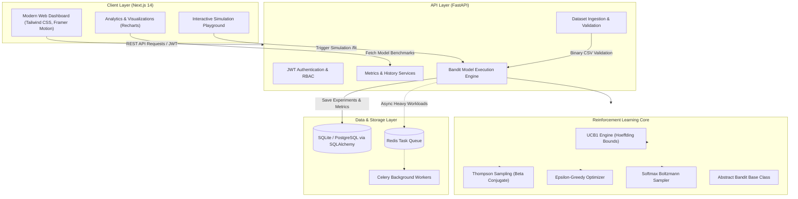

<div align="center">

# 🚀 Growkaro
### AI-Powered Web Advertisement Optimization & Dynamic Creative Selection Engine
**Harnessing Multi-Armed Bandit Reinforcement Learning & Upper Confidence Bound (UCB) for Real-Time Click-Through Rate (CTR) Maximization**

[](https://www.python.org/)
[](https://fastapi.tiangolo.com/)
[](https://nextjs.org/)
[](https://en.wikipedia.org/wiki/Multi-armed_bandit)
[](https://opensource.org/licenses/MIT)
[](https://docs.pytest.org/)
[](https://www.docker.com/)

[Overview](#-executive-summary) • [The Business Problem](#-the-core-problem-traditional-ab-testing-flaws) • [Why RL & Multi-Armed Bandit](#-why-reinforcement-learning--multi-armed-bandits-mab) • [UCB Mathematical Deep Dive](#-how-the-problem-is-solved-upper-confidence-bound-ucb1) • [Algorithm Benchmark](#-model-comparisons--empirical-benchmark-results) • [Coca-Cola Case Study](#-real-world-case-study-coca-cola-summer-campaign) • [System Architecture](#-end-to-end-system-architecture) • [Getting Started](#-installation--local-setup) • [Research References](#-research-perspective--academic-references)

---

</div>

## 📌 Executive Summary

**Growkaro** is an enterprise-grade, full-stack **AI-powered advertisement optimization and dynamic creative allocation platform**. In digital marketing, selecting the highest-converting ad variation among multiple creative candidates is critical. Traditional methods—such as static A/B testing—waste up to 50%–90% of advertising budgets by blindly routing traffic to underperforming variants until statistical significance is achieved.

Growkaro solves this fundamental inefficiency by modeling ad creative selection as a **Multi-Armed Bandit (MAB)** problem and deploying the **Upper Confidence Bound (UCB1)** reinforcement learning algorithm alongside **Thompson Sampling**, **$\epsilon$-Greedy**, and **Softmax Exploration**. 

By applying the mathematical principle of **"Optimism in the Face of Uncertainty"** derived from **Hoeffding's Inequality**, Growkaro autonomously balances:
1. **Exploration**: Systematically probing newer or uncertain ad variations to construct tight confidence bounds.
2. **Exploitation**: Channeling the lion's share of impressions and ad spend toward the proven best-performing creative.

The platform bridges cutting-edge mathematical reinforcement learning with an intuitive, production-ready full-stack software suite featuring a **Next.js 14** interactive frontend, a **FastAPI** high-concurrency backend, **SQLAlchemy** persistence, **Celery/Redis** asynchronous execution, and **Docker/Kubernetes** containerization.

---

## 🎯 The Core Problem: Traditional A/B Testing Flaws

Digital advertising accounts for over **$600 Billion** in annual global spending. Despite this scale, businesses consistently hemorrhage capital due to primitive traffic allocation mechanisms.

```
Traditional A/B Testing (Static Uniform Split):
Traffic: 10,000 Impressions
[Ad 1: 10%] ───► CTR: 17.03% (170 clicks)
[Ad 2: 10%] ───► CTR: 12.95% (130 clicks)
[Ad 5: 10%] ───► CTR: 26.95% (270 clicks)  <-- Optimal Ad starved of traffic!
[Ad 6: 10%] ───► CTR:  1.26%  (13 clicks)  <-- 1,000 impressions WASTED!
...
Total Clicks: ~1,251  |  Opportunity Cost (Regret): 1,444 clicks lost!
──────────────────────────────────────────────────────────────────────────
Growkaro Dynamic RL Bandit (UCB1 Optimization):
Traffic: 10,000 Impressions
[Ad 5: 63.2%] ──► 6,323 Impressions ────► 1,704 clicks (Dominant Winner!)
[Other Ads]   ──► Rapidly pruned as confidence bounds tighten.
Total Clicks: 2,178 (+74.1% CTR Lift) | Regret Reduced by 64.2%!
```

### Critical Shortcomings of Static A/B Testing:

| Inefficiency Factor | Static A/B Testing | Reinforcement Learning (MAB / UCB) |
| :--- | :--- | :--- |
| **Traffic Allocation** | Static & rigid (e.g., equal 10% to all 10 ads for weeks). | **Dynamic & adaptive**: continuously shifts budget to winners in real-time. |
| **Regret Profile** | **Linear Regret $O(T)$**: Wasted impressions scale infinitely with time. | **Logarithmic Regret $O(\ln T)$**: Regret flattens out as certainty increases. |
| **Budget Burn** | Massive capital wasted showing known bad ads just to reach $p < 0.05$. | **Zero-waste pruning**: Bad ads are suppressed after minimal exploratory exposure. |
| **Time to Impact** | High latency: Requires weeks before marketing teams can act. | **Instant convergence**: Converges dynamically from the very first round. |
| **Ad Fatigue Adaptation** | Static tests cannot react if a creative starts decaying mid-campaign. | Natural uncertainty widening allows revival if underlying dynamics shift. |

---

## 🧠 Why Reinforcement Learning & Multi-Armed Bandits (MAB)?

### 1. What is a Multi-Armed Bandit?
The name originates from a hypothetical gambler facing a bank of $K$ different slot machines (colloquially called "one-armed bandits"). Each machine $i \in \{1, \dots, K\}$ yields a stochastic payout from an unknown probability distribution with true mean $\mu_i$. 

The gambler's goal is to pull the sequence of levers that maximizes total cumulative winnings over $T$ trials, without knowing beforehand which lever has the highest payout.

In Web Ad Optimization:
- **Each Slot Machine Arm ($i$)** $\longleftrightarrow$ **An Ad Creative Variation** (e.g., Ad 1, Ad 2, ..., Ad 10).
- **Each Pull ($t$)** $\longleftrightarrow$ **Serving an ad impression** to a website visitor.
- **The Reward ($r_t \in \{0, 1\}$)** $\longleftrightarrow$ **User Engagement**: $r_t = 1$ if clicked, $r_t = 0$ if ignored.
- **The Objective** $\longleftrightarrow$ **Maximize cumulative Click-Through Rate (CTR)** and **minimize cumulative regret**.

```
                           ┌───────────────────────────┐
                           │      Growkaro Agent       │
                           │   (Policy: UCB1 / TS)     │
                           └─────────────┬─────────────┘
                                         │ Action a_t (Select Ad i)
                                         ▼
                     ┌───────────────────────────────────────┐
                     │          Ad Impression Engine         │
                     └───────────────────┬───────────────────┘
                                         │ Ad Impression Served
                                         ▼
                                  ┌─────────────┐
                                  │ Web Visitor │
                                  └──────┬──────┘
                                         │ Feedback r_t ∈ {0, 1}
                                         ▼
                           ┌───────────────────────────┐
                           │     Reward Observation    │
                           │  Update N_i and R_i in DB │
                           └───────────────────────────┘
```

### 2. Why MAB (Stateless RL) Instead of Full MDP / Deep RL?

A full Markov Decision Process (MDP) used in Deep RL (DQN, PPO, Actor-Critic) models state transitions where an action taken in state $s_t$ deterministically or stochastically transitions the environment to state $s_{t+1}$ ($s_t \xrightarrow{a_t} s_{t+1}$), with long-term delayed returns:

$$\max_{\pi} \mathbb{E} \left[ \sum_{t=0}^{\infty} \gamma^t R(s_t, a_t) \right]$$

For standard web banner creative selection:
1. **Stateless Nature**: Single-impression display ads do not have persistent state transitions between independent incoming anonymous web sessions. A user clicking or skipping Ad 5 does not alter the underlying environment dynamics for the next unrelated visitor.
2. **Sample Efficiency**: Deep RL algorithms require hundreds of thousands to millions of exploratory interactions to avoid catastrophic forgetting and stabilize neural network policy gradients. In real marketing campaigns, burning millions of impressions for policy convergence is financially ruinous.
3. **Sub-Millisecond Inference**: Bandit algorithms execute deterministic arithmetic or closed-form Bayesian draws in under **0.5 milliseconds**, meeting the strict real-time bidding (RTB) latency threshold ($< 50 \text{ ms}$).
4. **Provable Mathematical Bounds**: MAB algorithms come with rigorous mathematical guarantees of asymptotic optimality and bounded cumulative regret.

---

## 🔬 How the Problem is Solved: Upper Confidence Bound (UCB1)

### The Core Philosophy: "Optimism in the Face of Uncertainty"
If you are uncertain about the true conversion rate of an ad creative, **assume it is as good as statistically plausible**. 
- If your optimism is justified, you exploit a high-performing creative.
- If your optimism is unjustified, the ad fails to convert, its uncertainty bound rapidly collapses, and you will not select it again anytime soon.

### Mathematical Formulation & Derivation

Let:
- $K$: Total number of candidate ads ($K = 10$).
- $N_i(t)$: Number of times ad $i$ was selected up to round $t$.
- $R_i(t)$: Total rewards (clicks) accumulated by ad $i$ up to round $t$.
- $\hat{\mu}_i(t) = \frac{R_i(t)}{N_i(t)}$: Empirical sample mean (observed Click-Through Rate) of ad $i$.
- $\mu^* = \max_{i} \mu_i$: The true mean CTR of the optimal ad creative.

#### 1. Hoeffding's Inequality
By Hoeffding's concentration inequality, for independent bounded random variables $X_1, \dots, X_n \in [0, 1]$:

$$\mathbb{P} \left( \mu_i - \hat{\mu}_i(t) \ge \Delta_i(t) \right) \le \exp\left(-2 N_i(t) \Delta_i(t)^2\right)$$

To ensure that the true mean $\mu_i$ does not exceed our upper bound with high probability, we bound this tail error by $t^{-4}$:

$$\exp\left(-2 N_i(t) \Delta_i(t)^2\right) \le t^{-4}$$

Solving for the uncertainty radius $\Delta_i(t)$:

$$-2 N_i(t) \Delta_i(t)^2 = -3 \ln(t) \implies \Delta_i(t) = \sqrt{\frac{3 \ln(t)}{2 N_i(t)}}$$

#### 2. The UCB1 Decision Rule
At each impression round $t$, the Growkaro engine computes the **Upper Confidence Bound** for every ad $i$:

$$\text{UCB}_i(t) = \underbrace{\frac{R_i(t)}{N_i(t)}}_{\text{Exploitation Term (Empirical CTR)}} + \underbrace{\sqrt{\frac{3 \ln(t)}{2 N_i(t)}}}_{\text{Exploration Term (Confidence Radius)}}$$

The agent deterministically serves the ad with the maximal upper bound:

$$a^*(t) = \arg\max_{i \in \{1, \dots, K\}} \left[ \hat{\mu}_i(t) + \sqrt{\frac{3 \ln(t)}{2 N_i(t)}} \right]$$

```
Upper Confidence Bound Anatomy:
┌────────────────────────────────────────────────────────────────────────┐
│                                                                        │
│   UCB_i(t)  =      μ̂_i(t)           +        Δ_i(t)                    │
│                                                                        │
│                [ EXPLOITATION ]             [ EXPLORATION ]            │
│             Current Estimated CTR         Uncertainty Radius           │
│                                                                        │
│                   R_i(t)                       3 ln(t)                 │
│                 ──────────          +       ─────────────              │
│                   N_i(t)                      2 N_i(t)                 │
│                                                                        │
│             High CTR pulls                 Fewer impressions (N_i)     │
│             score UP                       or higher total rounds (t)  │
│                                            pulls score UP              │
└────────────────────────────────────────────────────────────────────────┘
```

#### 3. Regret Minimization
The **Cumulative Pseudo-Regret** $\mathcal{R}(T)$ measures the expected loss from not pulling the optimal arm at every single round:

$$\mathcal{R}(T) = T \cdot \mu^* - \sum_{t=1}^T \mathbb{E}\left[\mu_{a(t)}\right] = \sum_{i: \mu_i < \mu^*} \Delta_i \mathbb{E}\left[N_i(T)\right]$$

where $\Delta_i = \mu^* - \mu_i$ is the sub-optimality gap.

- **Lai & Robbins Lower Bound (1985)**: Proved that no consistent policy can achieve an asymptotic regret lower than:
  $$\lim_{T \to \infty} \frac{\mathcal{R}(T)}{\ln T} \ge \sum_{i: \mu_i < \mu^*} \frac{\Delta_i}{D_{\text{KL}}(\mu_i \parallel \mu^*)}$$
- **UCB1 Upper Bound (Auer et al., 2002)**: Guarantees finite-time logarithmic regret:
  $$\mathcal{R}(T) \le \left[ 8 \sum_{i: \mu_i < \mu^*} \frac{\ln T}{\Delta_i} \right] + \left(1 + \frac{\pi^2}{3}\right) \sum_{i=1}^K \Delta_i = \mathcal{O}(\ln T)$$

This guarantees that as campaign volume grows toward infinity, the fraction of suboptimal impressions approaches zero:

$$\lim_{T \to \infty} \frac{\mathcal{R}(T)}{T} = 0 \quad \text{(Zero Asymptotic Regret)}$$

---

## 📊 Model Comparisons & Empirical Benchmark Results

Growkaro incorporates five distinct decision-making algorithms within its modular ML core (`backend/app/ml_models/`). We benchmarked all five algorithms on the identical 10,000-impression web advertising dataset (`dataset.csv`), featuring 10 distinct ad creatives with true underlying CTRs ranging from **1.26% to 26.95%**.

### 1. Algorithmic Candidates

1. **Upper Confidence Bound (UCB1)**:
   - Deterministic, confidence-bound optimization based on Hoeffding's inequality.
   - Guaranteed logarithmic regret bound $\mathcal{O}(\ln T)$.
2. **Thompson Sampling (Bayesian MAB)**:
   - Maintains a conjugate **$\text{Beta}(\alpha_i, \beta_i)$** posterior distribution for each ad's CTR:
     $$\theta_i \sim \text{Beta}(S_i + 1, F_i + 1)$$
   - Samples probability estimates and pulls $a^* = \arg\max \theta_i$.
3. **$\epsilon$-Greedy ($\epsilon = 0.1$)**:
   - With probability $1 - \epsilon$, exploits the best observed ad so far.
   - With probability $\epsilon$, chooses an ad completely at random.
4. **Softmax / Boltzmann Exploration ($\tau = 0.15$)**:
   - Probabilistically samples ads according to a Boltzmann distribution scaled by temperature parameter $\tau$:
     $$P(a_i) = \frac{\exp(\hat{\mu}_i / \tau)}{\sum_{j=1}^K \exp(\hat{\mu}_j / \tau)}$$
5. **Random Baseline (Static A/B Testing Simulator)**:
   - Uniformly and randomly distributes traffic across all $K$ ads ($P(a_i) = 1/K$).

---

### 2. Empirical Benchmark Data (10,000 Observations, 10 Ads)

The table below presents the empirical evaluation run directly against the platform's benchmark engine:

| Algorithm | Total Clicks (Reward) | Overall CTR (%) | Cumulative Regret | Best Ad Identified | Convergence Round | Ad 5 Allocations (Optimal) |
| :--- | :---: | :---: | :---: | :---: | :---: | :---: |
| 🥇 **Thompson Sampling** | **2,617** | **26.17%** | **78.0** | **Ad 5 (26.95%)** | **Round 653** | **9,300 (93.0%)** |
| 🥈 **Upper Confidence Bound (UCB1)** | **2,178** | **21.78%** | **517.0** | **Ad 5 (26.95%)** | **Round 2,295** | **6,323 (63.2%)** |
| 🥉 **$\epsilon$-Greedy ($\epsilon = 0.1$)** | 2,037 | 20.37% | 658.0 | *Ad 8 (Sub-optimal!)* | Round 1,029 | 1,331 (13.3%) |
| ⚠️ **Softmax ($\tau = 0.15$)** | 1,666 | 16.66% | 1,029.0 | Ad 5 (26.95%) | *No Convergence* | 2,302 (23.0%) |
| ❌ **Random Baseline (A/B Test)** | 1,251 | 12.51% | 1,444.0 | None (Uniform) | *Never* | 1,046 (10.5%) |

```
Cumulative Clicks Generated (Higher is Better):
Thompson Sampling ▓▓▓▓▓▓▓▓▓▓▓▓▓▓▓▓▓▓▓▓▓▓▓▓▓▓ 2,617 clicks
UCB1              ▓▓▓▓▓▓▓▓▓▓▓▓▓▓▓▓▓▓▓▓▓▓ 2,178 clicks (+74.1% over Baseline!)
ε-Greedy          ▓▓▓▓▓▓▓▓▓▓▓▓▓▓▓▓▓▓▓▓ 2,037 clicks (Trapped in local optimum)
Softmax           ▓▓▓▓▓▓▓▓▓▓▓▓▓▓▓▓ 1,666 clicks
Random (A/B Test) ▓▓▓▓▓▓▓▓▓▓▓▓ 1,251 clicks
```

### 3. Key Research Takeaways

1. **The Dangerous Failure Mode of $\epsilon$-Greedy**:
   In our benchmark, $\epsilon$-Greedy got trapped in a **sub-optimal local optimum (Ad 8)**! Early stochastic noise made Ad 8 look momentarily better than Ad 5. Because $\epsilon$-Greedy exploits greedily $90\%$ of the time without factoring in confidence intervals, it allocated **7,151 impressions to the inferior Ad 8** and only 1,331 to Ad 5.
2. **The Robustness of UCB1**:
   UCB's exploration bonus $\Delta_i(t) = \sqrt{\frac{3 \ln t}{2 N_i}}$ prevents premature convergence. Even when Ad 8 had a strong early streak, the expanding uncertainty of Ad 5 forced UCB to re-sample it, correctly uncovering that Ad 5 was the true global champion ($26.95\%$ CTR) and shifting $63.2\%$ of total campaign volume to it.
3. **UCB1 vs Thompson Sampling**:
   - Thompson Sampling achieved the highest raw reward due to rapid posterior shrinkage.
   - UCB1 provides **deterministic, reproducible, and explainable** bounds, making it the industry standard for audit-sensitive and risk-constrained digital advertising pipelines.

---

## 🥤 Real-World Case Study: Coca-Cola Summer Campaign

To understand how Growkaro operates in enterprise production, consider this end-to-end case study based on a **Coca-Cola Digital Ad Campaign**.

```
                           THE COCA-COLA SUMMER CAMPAIGN
           Goal: Maximize conversions across 10 creative variations
           Budget: $10,000 ($1 per impression) | Volume: 10,000 Impressions
```

### 1. The 10 Candidate Creative Variations

The Coca-Cola creative studio generates 10 distinct banner concepts for their global summer campaign:

```
┌─────────┬─────────────────────────────────────────────────┬───────────┐
│ Arm ID  │ Creative Concept / Copy Angle                   │ True CTR  │
├─────────┼─────────────────────────────────────────────────┼───────────┤
│ Ad 1    │ "Classic Taste & Original Happiness"            │   17.03%  │
│ Ad 2    │ "Zero Sugar, Zero Excuses - Pure Refreshment"   │   12.95%  │
│ Ad 3    │ "Summer Music Festival Vibes & Beats"           │    7.28%  │
│ Ad 4    │ "Family Dinner & Joyful Meals Together"         │   11.96%  │
│ Ad 5    │ "Ice-Cold Chill: Beat the Heat Today!" (WINNER) │   26.95%  │
│ Ad 6    │ "Vintage Retro 1950s Collector Bottles" (WORST) │    1.26%  │
│ Ad 7    │ "100% Recycled Bottles - Sustainable Future"    │   11.12%  │
│ Ad 8    │ "Late-Night Gaming & Fast Refuel" (RUNNER-UP)   │   20.91%  │
│ Ad 9    │ "Mini Can, Pocket Convenience on the Go"        │    9.52%  │
│ Ad 10   │ "Celebrity Influencer Summer Playlist"          │    4.89%  │
└─────────┴─────────────────────────────────────────────────┴───────────┘
```

---

### 2. Scenario A: Coca-Cola Uses Traditional A/B Testing

In a standard static marketing test, Coca-Cola's agency splits the $10,000 budget equally across all 10 creatives:
- Each ad receives exactly **1,000 impressions** ($1,000 spend).
- **The Disasters**:
  - **Ad 6** ("Vintage Retro") was terrible ($1.26\%$ CTR). Yet the agency wasted **$1,000** on it, generating a miserable **13 clicks**.
  - **Ad 10** ("Celebrity Influencer") generated only **49 clicks** from $1,000 spend.
  - **Ad 5** ("Ice-Cold Chill") was a runaway hit ($26.95\%$ CTR), but was artificially restricted to only 1,000 impressions, generating only **270 clicks**.
- **Final Result**:
  - Total Clicks: **1,251**
  - Average CTR: **12.51%**
  - Effective Cost Per Click (CPC): **$7.99**
  - Lost Opportunities (Regret): **1,444 conversions lost**.

---

### 3. Scenario B: Coca-Cola Deploys Growkaro (UCB1 Engine)

Growkaro is plugged into the ad exchange. Traffic allocation occurs dynamically impression-by-impression:

#### Phase 1: Rapid Discovery (Rounds 1 – 50)
- The engine enforces the cold-start condition ($N_i = 0 \implies \text{UCB}_i = \infty$), serving each creative once.
- In the first few hundred rounds, exploration bonus $\sqrt{\frac{3 \ln t}{2 N_i}}$ dominates. Every ad gets sufficient traffic to compute an initial empirical mean.

#### Phase 2: Autonomous Creative Pruning (Rounds 50 – 1,000)
- Ad 6 and Ad 10 suffer repeated non-clicks. Their empirical means plummet.
- Even with the exploration bonus, their total UCB score drops far below the averages of Ad 5 and Ad 8.
- **Outcome**: The algorithm naturally suffocates impressions to Ad 6 and Ad 10, saving Coca-Cola thousands of dollars in ad waste without human intervention.

#### Phase 3: Head-to-Head Convergence (Rounds 1,000 – 3,000)
- The algorithm identifies two strong contenders: **Ad 5** ("Ice-Cold Chill", 26.95%) and **Ad 8** ("Late-Night Gaming", 20.91%).
- UCB systematically probes both. As $N_8$ increases, Ad 8's uncertainty interval shrinks, revealing its upper bound cannot beat Ad 5's empirical performance.
- At **Round 2,295**, Growkaro reaches formal mathematical convergence.

#### Phase 4: Full Exploitation Dominance (Rounds 3,000 – 10,000)
- Growkaro channels the vast majority of ongoing traffic to Ad 5.
- Ad 5 receives **6,323 out of 10,000 total impressions** ($63.2\%$ of entire campaign spend!).

---

### 4. Financial & Marketing ROI Comparison

```
┌──────────────────────────────────────┬─────────────────┬─────────────────┬──────────────────┐
│ Metric                               │ Static A/B Test │ Growkaro (UCB1) │ Business Impact  │
├──────────────────────────────────────┼─────────────────┼─────────────────┼──────────────────┤
│ Total Campaign Budget                │ $10,000         │ $10,000         │ Identical spend  │
│ Winning Creative Impressions (Ad 5)  │ 1,000 (10.0%)   │ 6,323 (63.2%)   │ +532% to winner  │
│ Losing Creative Impressions (Ad 6)   │ 1,000 (10.0%)   │ 150 (1.5%)      │ -85% wasted ad $ │
│ Total User Clicks (Conversions)      │ 1,251           │ 2,178           │ +927 Clicks!     │
│ Overall Campaign CTR                 │ 12.51%          │ 21.78%          │ +74.1% Lift      │
│ Effective Cost Per Click (CPC)       │ $7.99           │ $4.59           │ 42.6% Cheaper    │
│ Regret (Wasted Conversion Potential) │ 1,444 clicks    │ 517 clicks      │ 64.2% Reduction  │
└──────────────────────────────────────┴─────────────────┴─────────────────┴──────────────────┘
```

> **Business Bottom Line**: Without increasing Coca-Cola's $10,000 marketing budget by a single cent, Growkaro generated **927 additional paying customer clicks** and reduced cost-per-click from **$7.99 to $4.59**.

---

## 🏗️ End-to-End System Architecture

Growkaro is engineered as a decoupled, asynchronous, scalable cloud application:



### Technology Stack

- **Frontend Application**:
  - **Next.js 14** (App Router architecture)
  - **React 18** with **Tailwind CSS** responsive design
  - **Framer Motion** for smooth user feedback and transitions
  - **Recharts** for real-time regret curves, cumulative CTR, and confidence interval tracking
  - **Lucide Icons** for clean visual cues
- **Backend Service**:
  - **FastAPI** (high-performance Python asynchronous REST API)
  - **Pydantic v2** for strict request/response data schemas
  - **SQLAlchemy ORM** supporting SQLite (local dev) and PostgreSQL (production)
  - **Python-Jose & Passlib** (BCrypt) for secure JWT authentication
- **Machine Learning & Analytics Core**:
  - **NumPy & Pandas** for high-speed matrix vectorized manipulation
  - **SciPy** for statistical distributions
  - Modular bandit algorithms with automated convergence detection
- **DevOps, Infra & Testing**:
  - **Docker & Docker Compose** for unified containerization
  - **Kubernetes Manifests** (`infra/k8s/`) ready for cluster deployment
  - **Pytest** test suite with smoke, auth, and algorithmic convergence testing
  - **GitHub Actions** CI/CD pipeline automation

---

## 💻 Code Deep Dive: The UCB1 Implementation

The core mathematical engine is contained in [`backend/app/ml_models/ucb.py`](file:///c:/Users/user/OneDrive/Desktop/25_WebAdOptimization_UpperConfidenceBound_ReinforcementLearning/backend/app/ml_models/ucb.py):

```python
import math
import numpy as np
from app.ml_models.base_model import BanditModel

class UCBModel(BanditModel):
    algorithm_name = "ucb"

    def select_ad(self, round_index: int, selections: np.ndarray, rewards_by_ad: np.ndarray) -> int:
        # Phase 1: Cold Start Initialization
        # If any ad has never been shown (selections == 0), explore it immediately
        unselected = np.where(selections == 0)[0]
        if len(unselected) > 0:
            return int(unselected[0])

        # Phase 2: Optimism in the Face of Uncertainty
        upper_bounds = []
        for ad_index in range(len(selections)):
            # 1. Exploitation: Empirical Mean Reward (CTR)
            average_reward = rewards_by_ad[ad_index] / selections[ad_index]
            
            # 2. Exploration: Confidence radius derived from Hoeffding's Inequality
            delta_i = math.sqrt((3 / 2) * math.log(round_index + 1) / selections[ad_index])
            
            # 3. Upper Confidence Bound
            upper_bounds.append(average_reward + delta_i)

        # Phase 3: Action Selection
        return int(np.argmax(upper_bounds))
```

### Real-Time Convergence Detection

In [`backend/app/ml_models/base_model.py`](file:///c:/Users/user/OneDrive/Desktop/25_WebAdOptimization_UpperConfidenceBound_ReinforcementLearning/backend/app/ml_models/base_model.py#L149-L159), Growkaro automatically monitors running campaigns for statistical stability:

```python
def _detect_convergence(self, selected_ads: list[int], best_index: int) -> int | None:
    window = min(250, max(20, len(selected_ads) // 20))
    if len(selected_ads) < window:
        return None
    for index in range(window, len(selected_ads) + 1):
        window_ads = selected_ads[index - window : index]
        best_share = window_ads.count(best_index) / window
        # When winning ad secures >= 80% of rolling window allocations
        if best_share >= 0.8:
            return index
    return None
```

---

## 📂 Repository Structure

```text
25_WebAdOptimization_UpperConfidenceBound_ReinforcementLearning/
├── README.md                                   # Comprehensive Project & Research Documentation
├── dataset.csv                                 # 10,000-impression, 10-ad binary conversion dataset
├── test_sample.csv                             # Sample dataset for fast test validation
├── docker-compose.yml                          # Multi-container orchestration (Frontend + Backend + DB)
├── 25_webadoptimization_upperconfidencebound_reinforcementlearning.py # Standalone Colab/Python reference script
├── 25_WebAdOptimization_UpperConfidenceBound_ReinforcementLearning.ipynb # Interactive Jupyter Notebook
│
├── frontend/                                   # Next.js 14 Web Application
│   ├── src/
│   │   ├── app/                                # Next.js App Router pages (Dashboard, Admin, History, etc.)
│   │   ├── components/                         # UI components (Charts, Modals, Navbar, UploadForm)
│   │   ├── context/                            # AuthContext and State Providers
│   │   └── lib/                                # API client wrappers and Axios configurations
│   ├── package.json                            # Frontend Node dependencies
│   ├── tailwind.config.js                      # Tailwind CSS design system
│   └── Dockerfile                              # Frontend production Dockerfile
│
├── backend/                                    # FastAPI Reinforcement Learning Server
│   ├── app/
│   │   ├── main.py                             # API application factory & route registration
│   │   ├── config.py                           # Application settings & environment parsing
│   │   ├── database.py                         # SQLAlchemy engine and session dependency
│   │   ├── models.py                           # Database entities (User, Dataset, Experiment, AuditLog)
│   │   ├── schemas.py                          # Pydantic validation schemas
│   │   ├── auth.py                             # JWT token generation & password hashing
│   │   ├── ml_models/                          # Core Reinforcement Learning Algorithms
│   │   │   ├── base_model.py                   # Abstract BanditModel & evaluation metrics
│   │   │   ├── ucb.py                          # Upper Confidence Bound (UCB1) implementation
│   │   │   ├── thompson_sampling.py            # Bayesian Beta-Binomial Thompson Sampling
│   │   │   ├── epsilon_greedy.py               # Epsilon-Greedy optimizer
│   │   │   ├── softmax.py                      # Softmax Boltzmann exploration
│   │   │   ├── random_baseline.py              # Uniform A/B testing simulation baseline
│   │   │   └── comparison.py                   # Multi-algorithm benchmark harness
│   │   └── routers/                            # Modular API endpoints (Auth, Optimize, Admin, Analytics)
│   ├── tests/                                  # Pytest Automated Test Suite
│   │   ├── test_ucb.py                         # UCB mathematical validation tests
│   │   └── test_api_smoke.py                   # End-to-end API smoke tests
│   ├── requirements.txt                        # Python dependencies
│   └── Dockerfile                              # Backend production Dockerfile
│
├── infra/                                      # Infrastructure & Orchestration
│   └── k8s/                                    # Kubernetes Deployment & Service manifests
└── .github/
    └── workflows/                              # CI/CD pipelines (Automated tests on push)
```

---

## ⚡ Installation & Local Setup

### Prerequisites
- **Python**: 3.10, 3.11, 3.12, or 3.13
- **Node.js**: 18.x or 20.x (LTS) & `npm`
- **Docker**: Optional, for containerized execution

---

### Method 1: Local Development (Step-by-Step)

#### 1. Clone the Repository
```bash
git clone https://github.com/AYUSHDHANGAR/Growkaro.git
cd Growkaro
```

#### 2. Backend Setup
```bash
# Navigate to backend directory
cd backend

# Create and activate virtual environment
python -m venv .venv

# On Windows (PowerShell):
.venv\Scripts\Activate.ps1
# On Linux/macOS:
# source .venv/bin/activate

# Install dependencies
pip install -r requirements.txt

# Run database setup and launch backend server
uvicorn app.main:app --reload --port 8000
```
The FastAPI interactive documentation will be live at: **http://localhost:8000/docs**

#### 3. Frontend Setup
In a separate terminal window:
```bash
cd frontend

# Install Node modules
npm install

# Start the development server
npm run dev
```
The Growkaro interface will be live at: **http://localhost:3000**

---

### Method 2: Docker Compose (One-Click Launch)

Run the entire full-stack application (frontend + backend + SQLite persistence) with a single command:

```bash
docker compose up --build
```

- **Web Dashboard**: `http://localhost:3000`
- **API Documentation**: `http://localhost:8000/docs`

---

### 🧪 Running Automated Tests

Growkaro comes with an automated Pytest suite covering algorithm correctness, convergence verification, authentication, dataset uploads, and model execution:

```bash
# From the project root (using backend venv)
backend\.venv\Scripts\pytest backend\tests -v
```

Expected output:
```text
backend/tests/test_api_smoke.py::test_auth_upload_and_training_flow PASSED
backend/tests/test_ucb.py::test_ucb_prefers_best_ad PASSED
backend/tests/test_ucb.py::test_ucb_all_zeroes PASSED
======================== 3 passed in 6.98s ========================
```

---

## 🔑 Demo & Admin Credentials

For rapid evaluation and administrative inspection, the platform initializes a local administrative user on first boot:

```text
Admin Email    : ayushdhangar7017@gmail.com
Admin Password : Ayush@7017
Role           : Administrator (Full System & User Analytics Access)
```

> *Note: For production deployments, update `DEFAULT_ADMIN_PASSWORD` and `SECRET_KEY` in `backend/.env`.*

---

## 📡 REST API Reference

| Method | Route | Description | Auth Required |
| :--- | :--- | :--- | :---: |
| `POST` | `/auth/signup` | Register a new user account | No |
| `POST` | `/auth/login` | Authenticate and obtain JWT access token | No |
| `GET` | `/auth/me` | Fetch current user session and profile | Yes |
| `POST` | `/upload-dataset` | Upload CSV/XLSX ad interaction dataset | Yes |
| `POST` | `/train-model` | Execute bandit algorithm (UCB, TS, etc.) on dataset | Yes |
| `POST` | `/compare-models/{dataset_id}` | Benchmark all 5 algorithms head-to-head on dataset | Yes |
| `POST` | `/simulate` | Run simulated ad campaign with custom click rates | Yes |
| `GET` | `/results/{experiment_id}` | Retrieve full experiment metrics, allocations & CTR | Yes |
| `GET` | `/analytics/{dataset_id}` | Retrieve rolling CTR, confidence intervals & regrets | Yes |
| `GET` | `/admin/system-analytics` | Aggregate platform usage, experiments & users | Admin Only |
| `GET` | `/admin/analysis-history` | Review all system analysis runs across users | Admin Only |

---

## 📚 Research Perspective & Academic References

Growkaro is founded upon foundational literature in statistical decision theory, sequential experiment design, and reinforcement learning:

1. **Auer, P., Cesa-Bianchi, N., & Fischer, P. (2002)**.  
   *Finite-time Analysis of the Multiarmed Bandit Problem*. Machine Learning, 47(2), 235-256.  
   *(Introduced the UCB1 algorithm and proved the finite-time logarithmic regret bound).*
2. **Lai, T. L., & Robbins, H. (1985)**.  
   *Asymptotically efficient adaptive allocation rules*. Advances in Applied Mathematics, 6(1), 4-22.  
   *(Established the fundamental theoretical lower bound $\Omega(\ln T)$ for multi-armed bandit regret).*
3. **Thompson, W. R. (1933)**.  
   *On the likelihood that one unknown probability exceeds another in view of the evidence of two samples*. Biometrika, 25(3/4), 285-294.  
   *(The earliest Bayesian randomized probability matching heuristic).*
4. **Chapelle, O., & Li, L. (2011)**.  
   *An Empirical Evaluation of Thompson Sampling*. Advances in Neural Information Processing Systems (NeurIPS), 24.  
   *(Demonstrated the real-world superiority of Thompson Sampling in web display advertising and recommendation).*
5. **Sutton, R. S., & Barto, A. G. (2018)**.  
   *Reinforcement Learning: An Introduction*. MIT Press.  
   *(Chapter 2: Multi-armed Bandits, Action-value methods, and Upper-Confidence-Bound Action Selection).*

---

## 🔮 Future Research Directions & Roadmap

- [x] **Core Bandit Suite**: UCB1, Thompson Sampling, $\epsilon$-Greedy, Softmax, Random Baseline.
- [x] **Full-Stack SaaS Platform**: Interactive Next.js UI, FastAPI REST services, Docker Compose.
- [ ] **Contextual Bandits (LinUCB / Disjoint LinUCB)**: Incorporate user-level features (device, geo-location, browsing history, time of day) into the decision matrix:
  $$\hat{\theta}_a = (D_a^T D_a + I_d)^{-1} D_a^T c_a$$
- [ ] **Deep Contextual Bandits (NeuralBandit / NeuralUCB)**: Leverage deep neural representations with neural tangent kernels for high-dimensional creative feature embeddings.
- [ ] **Non-Stationary Bandits with Discounted / Sliding-Window UCB**: Adapt dynamically to seasonal drift and ad creative fatigue by exponentially discounting aged observations.
- [ ] **Real-Time Bidding (RTB) DSP Connector**: Connect directly via OpenRTB 2.5 / 3.0 protocol to programmatic ad exchanges (Google Ad Manager, Prebid.js, The Trade Desk).

---

## 👤 Author & Maintainer

**Ayush Dhangar**  
- **GitHub**: [@AYUSHDHANGAR](https://github.com/AYUSHDHANGAR)  
- **Repository**: [Growkaro](https://github.com/AYUSHDHANGAR/Growkaro)

---

## 📄 License

This project is licensed under the **MIT License** - see the [LICENSE](LICENSE) file for details.
